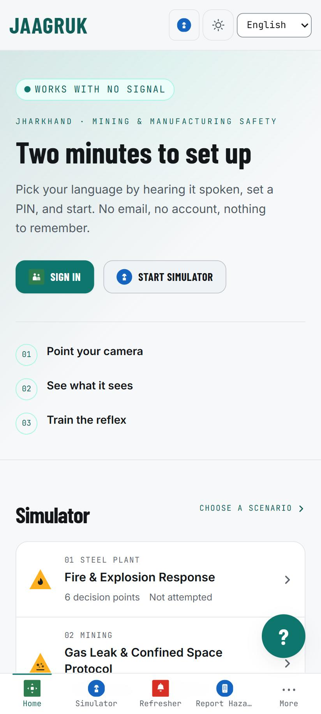
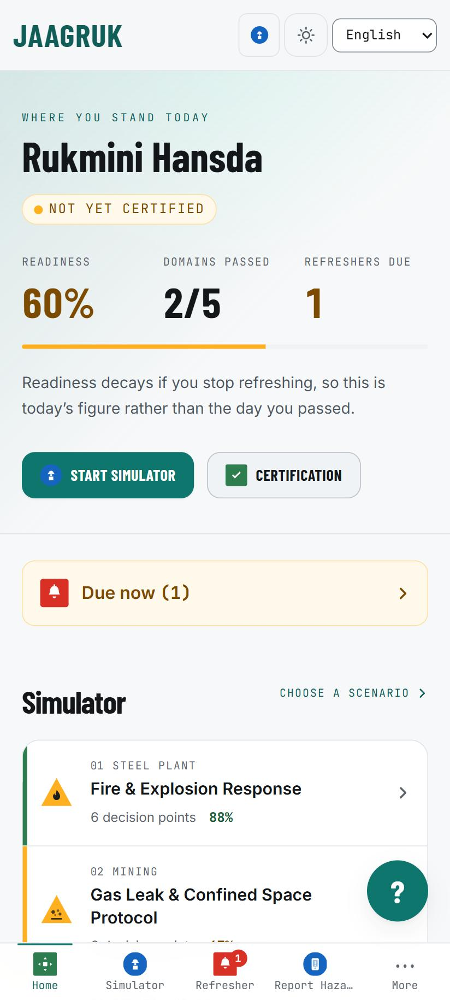
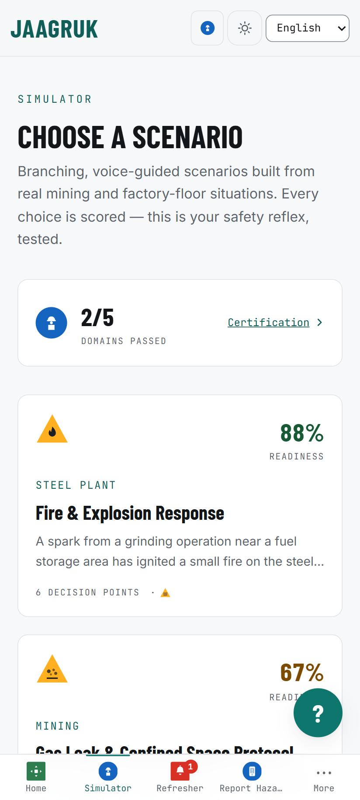
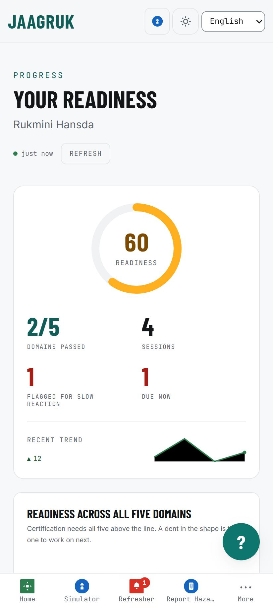
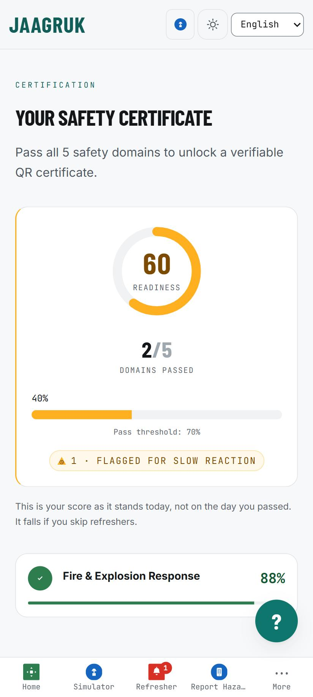
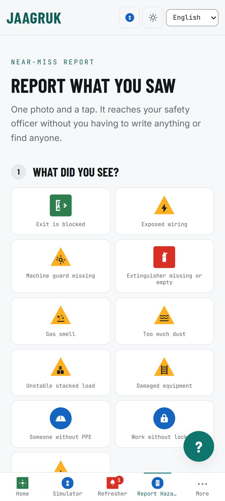
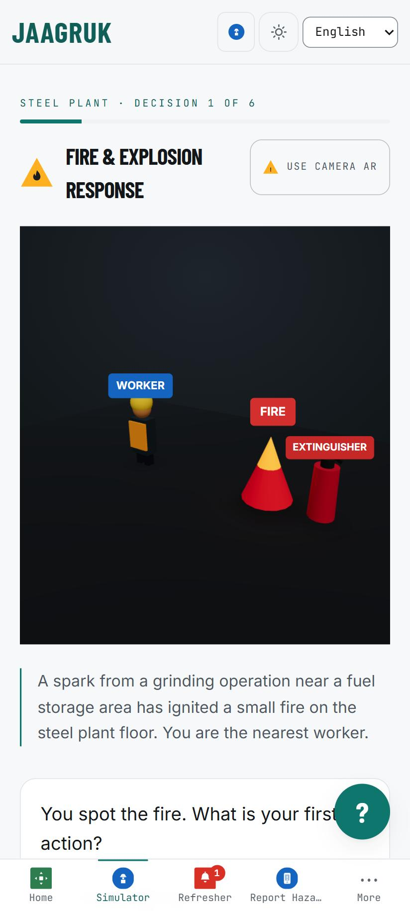
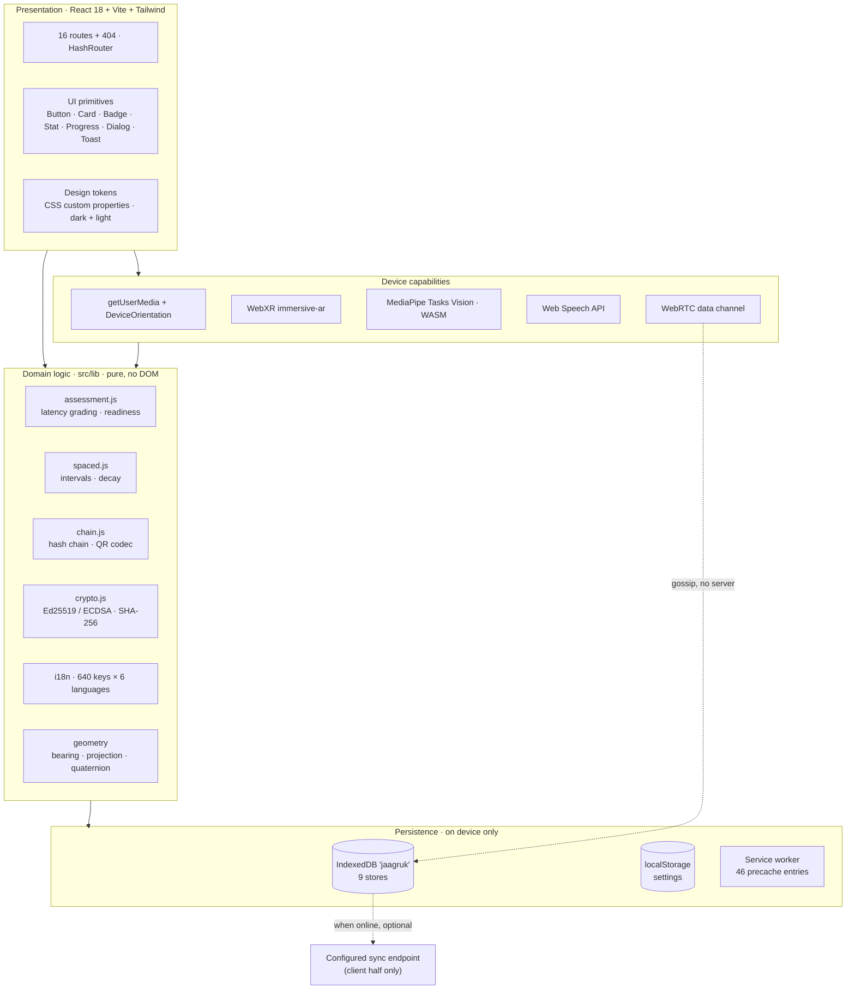

<div align="center">

# जागरुक · Jaagruk

**Safety training that happens where the accident would.**

AR-based vocational training and tamper-evident safety certification for Jharkhand's mining
and manufacturing workforce — on the phone a worker already owns, 200 m underground, with no
signal.

`Smart India Hackathon` · **Problem Statement 26041** · Government of Jharkhand,
Department of Higher & Technical Education


</div>

---

## Kotlin Android App

**[View the Jaagruk Kotlin App on GitHub](https://github.com/palakrai573/Jaagruk-app)**

The native Kotlin Android app is maintained in a separate repository. This repository contains the Jaagruk web application.

---

## The app

Every screenshot below is the running app at **412 × 915** — a Pixel-class Android viewport.

<div align="center">

| Home — new worker | Home — signed in | Scenario list |
|:---:|:---:|:---:|
|  |  |  |
| Signed out, the page leads with setup cost and the three-step loop. | Readiness, domains passed and refreshers due, with per-domain status rails. | Nine modules, each showing current standing rather than just a title. |

| Worker dashboard | Certification | Near-miss report |
|:---:|:---:|:---:|
|  |  |  |
| Readiness ring, hesitation flags, trend. | Gated on **today's** decayed readiness, not the test date. | Zero-text pictogram entry — one photo and a tap. |

| 3D drill runner |
|:---:|
|  |
| Camera unavailable degrades to the 3D scene — the drill is never blocked. |

</div>

> **Note on the drill screenshot.** It shows the 3D fallback because the capture environment
> blocks camera access. On a real handset over HTTPS the same screen renders the camera-anchored
> AR overlay; `docs/DEPLOYMENT.md` explains why AR needs a secure context.

---

## Contents

| | |
|---|---|
| [The problem](#the-problem) · [Why a quiz app isn't enough](#why-the-obvious-build-isnt-enough) | The case |
| [End to end](#how-it-works-end-to-end) · [The four layers](#the-four-layers) | The system |
| [Architecture](#architecture) · [Tech stack](#tech-stack) · [Key components](#key-components) · [Data model](#data-model) | The build |
| [Offline model](#offline-model) · [Security](#security-and-integrity) | The guarantees |
| [Efficiency and compression](#efficiency-and-compression) | **Measured numbers** |
| [Native comparison](#native-reference-vs-this-implementation) · [Use cases](#use-cases) | The context |
| [Quick start](#quick-start) · [Verification](#verification) · [Licence](#licence) | Running it |
| [Advantages](#advantages) · [Limitations](#honest-limitations) · [Future scope](#future-scope) | The honesty |

---

## The problem

Safety training in this sector is not missing. Inductions exist, posters exist, annual
refreshers exist. The problem is that it produces **a certificate rather than a reflex**.

> A worker passes a written test in March. In September a real gas alarm sounds, and he stands
> still for eleven seconds trying to remember what he read.
>
> **Nothing in the current system can even see those eleven seconds.**

Three failures cause this, and all three are invisible to conventional training:

| | |
|---|---|
| **Workers who know the right action still freeze** | Knowing the evacuation route and executing it in four seconds are different skills. |
| **Retention collapses within a week** | A one-time induction improves first exposure, not durability. |
| **The buddy system is two humans under stress** | You cannot train coordination alone with a phone. |

---

## Why the obvious build isn't enough

The baseline reading of this problem statement is *AR overlay → quiz → QR certificate →
dashboard*. That is correct scope. It is also what most submissions will be, and it leaves all
three failures untouched.

| The real problem | What a quiz-and-certificate app does | **What Jaagruk does** |
|---|---|---|
| Workers who *know* the right action still freeze | Nothing. Right/wrong scoring cannot see hesitation. | **Every decision is timed** against a per-step baseline. Correct-but-slow is flagged for retraining instead of quietly passed. |
| Retention falls sharply within a week | Nothing. A one-time module makes the first exposure better, not stickier. | **Readiness decays** with time and recovers on a refresher. Certification is gated on today's score, not the test date. |
| The buddy system is two humans coordinating | Simulates the buddy as an AI character — trains none of the coordination. | **Two real phones** paired over WebRTC, no server, no internet. Scored on check-in discipline and how long you took to notice your buddy collapse. |

Everything below is implementation detail. That table is the idea.

---

## How it works, end to end

```
SUPERVISOR · once per zone
  Site Setup ──► aim phone at exit, tap ──► aim at extinguisher, tap ──► …
       │              stores magnetic bearing + elevation + thumbnail
       └──► export zone bundle (JSON) ─────────────────┐
                                                       │ seeds every phone
WORKER · every shift                                   ▼
  Onboard (icon + voice + PIN) ──► import zone ──► pick a module
       │
       ├──► AR drill in the real corridor ──► decision ──► ⏱ LATENCY CAPTURED
       │                                            │
       │                              fast / normal / slow → hesitation flag
       │                                            ▼
       ├──► readiness = 0.7·accuracy + 0.3·speed
       │
       ├──► buddy drill (2nd phone, QR pairing) ──► coordination score
       │
       ├──► all 5 domains ≥ 70 effective? ──► CERTIFICATE signed + hash-chained
       │
       ├──► spot a real hazard ──► photo + voice + bearing ──► queued
       │
       └──► 2 / 7 / 21 / 60 days later ──► refresher due ──► readiness restored

INSPECTOR · at the pit head, no signal
  Scan QR ──► verify offline ──► 4 independent signals reported

SAFETY OFFICER · admin dashboard
  Hesitation-risk list · hazard triage · chain integrity · statutory CSV export
```

**The loop is the point.** Readiness decaying below 70 pushes the worker back to training. A
funnel produces certificates; a loop produces competence.

---

## The four layers

### 1 · Train — in the corridor you would actually run down

Two overlay layers are drawn over the live camera, and **they cannot disagree**. The flat
marker layer is absolutely-positioned DOM; above it `ARScene3D` draws real geometry. Both are
placed from **one** azimuth — `cameraQuaternion()` takes pitch and roll from the device
quaternion but overrides its yaw to equal the same smoothed heading the DOM markers use.
Feeding the raw sensor quaternion to the 3D camera would leave two independent estimates of
where the worker is looking, and they diverge whenever the compass is off.

Projection is true perspective, `tan(θ)/tan(fov/2)`. The vertical term divides by `cos(θ)` as
well, because off-axis vertical screen position genuinely depends on the horizontal angle.
Anchors beyond 90° are intercepted rather than divided, since the perspective divide changes
sign there and would fold an exit that is *behind* the worker back into the middle of frame.

A second mode (`webxr.js` + `XRDrill`) runs a WebXR `immersive-ar` session — on Chrome for
Android that is ARCore, giving real 6DoF tracking and hit-test placement with a measured
distance. Cross-device persistence uses a printed marker and two taps rather than Cloud
Anchors, so a zone scanned in XR still works on a phone that cannot run XR.

**The XR mode runs in Chrome, not in the APK.** Android WebView — which is what a Capacitor
APK renders in — has never implemented WebXR, so inside the APK `navigator.xr` is absent,
`webxr.js` reports it, and the drill runs the compass mode instead. Same app, same zones,
same scoring; only the tracking tier differs. Install the PWA from Chrome to get the XR tier.

Also in this layer: **MediaPipe hand tracking** (point to aim, pinch to confirm, 1.2 s dwell
fallback for gloved hands), **voice I/O** as a first-class parallel input, and a **zero-text
pictogram mode** where every step and choice renders as ISO 7010-style inline SVG with audio
narration.

### 2 · Assess — scored the way an emergency scores you

Every decision records `startedAt → decidedAt` against a calibrated per-step `targetMs`:

| Grade | Condition | Speed score |
|---|---|---|
| `fast` | within target | 100 |
| `normal` | within 2× target | 70 |
| `slow` | beyond 2× target → **hesitation flag** | 35 |
| `incorrect` | wrong answer → retrain regardless of speed | — |

```
readiness = round(0.7 × accuracy + 0.3 × speed)
```

A missing or absurd measurement grades `unknown` and scores 70 rather than punishing the
worker for a sensor or focus glitch.

**The buddy drill** pairs two phones over WebRTC by scanning each other's QR codes, then runs a
shared confined-space state machine. One side gets a scripted distress event; the other is
scored on whether they noticed, how fast they responded, and whether they ran the correct
sequence. Disconnects, timeouts, duplicate frames and role collisions are all handled
explicitly.

### 3 · Certify — a record that cannot be quietly edited

Canonical-JSON → SHA-256 → signed with a non-extractable Web Crypto key. Every record embeds
the previous record's hash, forming a per-site append-only chain.

Verification recomputes every hash and link and checks every signature, and reports the
**specific** failure — broken link, mutated payload, bad signature, unknown signer, sequence
gap, or fork — rather than a bare valid/invalid.

> **Terminology.** This is a **tamper-evident hash-chained ledger**, not a blockchain. There is
> no consensus, no distributed agreement, no mining. Calling it a blockchain would be
> inaccurate and any judge who knows the space would rightly mark it down.

### 4 · Sustain — keeping it true after the certificate prints

Spaced refresher intervals of **2, 7, 21 and 60 days** per domain. Readiness decays with time
since the last pass — full value for 7 days, then **linearly** to a 0.55 floor at 90 days:

```
decay(days) = 1 − 0.45 × (days − 7) / 83      for 7 < days ≤ 90
```

The curve is linear rather than exponential on purpose. A real forgetting curve is closer to
exponential, but a linear slide is legible: a worker or safety officer reading a roster can
tell at a glance how many days are left before a certification lapses. The floor exists
because training is degraded by disuse, not erased by it.

Certification requires **effective (decayed) readiness ≥ 70 in all five domains**, so a
certificate reflects current competence rather than a historical date stamp.

---

## Architecture



**No backend is required for any core path.** Training, assessment, certification and
verification all complete with the network cable pulled out. The only networked features are
the optional AI hazard scan and the optional central sync endpoint.

---

## Tech stack

| Layer | Choice | Why this one |
|---|---|---|
| UI | React 18 + Vite 5 | Single codebase ships as APK, PWA and browser demo |
| Styling | Tailwind CSS 3.4 over CSS custom properties | One `data-theme` attribute repaints SVG charts, pictograms and borders at the same instant |
| 3D / AR | three.js 0.170 + `@react-three/fiber` + `drei` | Lazy-loaded; a worker who never opens a 3D drill never downloads it |
| Immersive AR | WebXR `immersive-ar` | ARCore-backed on Chrome for Android — real 6DoF and hit-test |
| Hand tracking | `@mediapipe/tasks-vision` 0.10.18 | Same model family as native, WASM runtime |
| Object detection | EfficientDet-Lite0 (int8, COCO) | On-device headcount and vehicle proximity |
| Speech | Web Speech API | Voice command and narration in six languages |
| P2P | WebRTC `RTCDataChannel` + QR signalling | No signalling server, no internet |
| Crypto | Web Crypto — Ed25519, ECDSA P-256 fallback | Non-extractable key handles |
| Storage | IndexedDB (9 stores) + localStorage | The Room equivalent |
| Offline | `vite-plugin-pwa` / Workbox | Full precache of the app shell and vision models |
| Packaging | Capacitor 8 | Android APK from the same build |

**18 runtime dependencies (8 of them font subsets), 8 dev dependencies.** No charting library, no UI kit, no state
manager — the charts are hand-rolled inline SVG because the bundle already carries three.js
and they must render offline.

---

## Key components

| Path | Lines | Responsibility |
|---|---:|---|
| `src/lib/i18nJaagruk.js` | 1,584 | Main string table |
| `src/components/SafetyScene3D.jsx` | 1,401 | 3D drill scene and props |
| `src/lib/speech.js` | 1,295 | Narration, recognition, command lexicon |
| `src/lib/siteMap.js` | 1,167 | Zone / anchor model |
| `src/pages/Admin.jsx` | 974 | Compliance dashboard |
| `src/pages/Scenario.jsx` | 972 | Drill runner |
| `src/components/ARDrill.jsx` | 834 | Camera-anchored overlay |
| `src/pages/Dashboard.jsx` | 806 | Worker readiness view |
| `src/lib/hazards.js` | 715 | Near-miss capture, media compression |
| `src/lib/sync.js` | 704 | Queue, batching, idempotency |
| `src/lib/chain.js` | 586 | Hash chain, QR codec, verification |
| `src/lib/crypto.js` | 482 | Signing, hashing, key handling |

### Project structure

```
src/
  lib/          41 files · 17,324 lines   domain logic, pure, no DOM
  pages/        16 files ·  8,465 lines   one file per route
  components/   27 files ·  7,966 lines   AR, 3D, charts, UI primitives
  context/       1 file  ·     53 lines   language provider
  styles/        1 file  ·    337 lines   design tokens
tests/          21 files ·  4,734 lines   377 tests, node:test
scripts/         7 files ·  1,861 lines   a11y, contrast, i18n, translit gates
docs/                                     architecture, deployment, jury script
```

**Total application source: 86 files, 34,145 lines.**

---

## Data model

IndexedDB database `jaagruk`, version 1.

| Store | Key | Indexes | Contents |
|---|---|---|---|
| `workers` | `id` | `siteId`, `phone` | id, name, phone, pinHash, pinSalt, role, siteId |
| `chain` | `hash` | `siteId`, `seq`, `workerId` | signed certificate records |
| `keys` | `id` | — | device keypair handle, site public keys, algorithm |
| `attempts` | `id` | `workerId`, `domain`, `at` | per-step latency, grade, readiness |
| `schedule` | `id` (`workerId::domain`) | `workerId`, `dueAt` | interval index, lastPassAt, dueAt |
| `sites` | `id` | — | site + zones + anchors |
| `hazards` | `id` | `siteId`, `status`, `at` | report, thumbnail blob, voice note blob |
| `syncQueue` | `id` | `kind` | pending outbound records |
| `blobs` | `id` | — | cached ML model, media |

Small synchronous-read settings (language, API key, active session, accessibility toggles) stay
in `localStorage`. Legacy `khatra_*` keys migrate to `jaagruk_*` once, idempotently, on boot.

---

## Offline model

```
UI action
  └─> write to IndexedDB (always succeeds first, never blocks on network)
        └─> append to syncQueue
              ├─ internet available ──> POST batch to configured endpoint (idempotency key)
              └─ no internet ────────> gossip to nearby supervisor phone over WebRTC
                                          └─> supervisor gets internet later ──> POST batch
```

Every write is local-first, timestamped and additive. Sync is eventual and idempotent;
replaying a batch is always safe because records are keyed by content hash.

**Font strategy is part of the offline model.** Latin, Devanagari and Ol Chiki ship in the
precached shell so Hindi and Santali are fully styled on a cold offline start. Bengali, Odia and
Urdu are runtime-cached on first use instead — Nastaliq alone is ~317 KB for two weights, and
charging that to every worker's install would be the wrong default.

---

## Security and integrity

| Property | How |
|---|---|
| Certificate authenticity | Ed25519 signature over SHA-256 of canonical JSON, ECDSA P-256 fallback |
| Tamper evidence | Each record embeds the previous record's hash — editing one breaks every link after it |
| Offline verification | The **entire signed record travels in the QR**, so no lookup and no network is needed |
| Key protection | Non-extractable Web Crypto key handles in IndexedDB |
| Failure reporting | Verification names the specific fault: broken link, mutated payload, bad signature, unknown signer, sequence gap, fork |

**What this is not.** PIN auth is device-local and is offline-capable identity, not a security
boundary. The `/admin` gate is a local PIN, not real authorization — production needs
server-issued JWTs with RBAC. There is no hardware keystore in the browser, which is precisely
why chain records gossip to a second device.

---

## Efficiency and compression

All figures below are **measured off disk** after `npm run build`, in bytes. Reproduce them by
inspecting `dist/`. Gzip is level 9; brotli is Node's default quality.

### Shipped code

```
                               raw                                      brotli
app + domain logic         ████████████████████████████████████  926.8 KiB
             → brotli      ████████                              202.5 KiB   ▼ 78%

three.js renderer (lazy)   ████████████████████████████████      833.6 KiB
             → brotli      ███████                               184.4 KiB   ▼ 78%

wasm JS glue (2 files)     ███████████████                       397.9 KiB
             → brotli      ███                                    85.0 KiB   ▼ 79%

react + router             ██████                                159.9 KiB
             → brotli      █                                      45.7 KiB   ▼ 71%

mediapipe glue (lazy)      █████                                  136.0 KiB
             → brotli      █                                      34.8 KiB   ▼ 74%

app css (tailwind)         ██                                      53.8 KiB
             → brotli      ▏                                        9.3 KiB   ▼ 83%

service worker + workbox   █                                       26.4 KiB
             → brotli      ▏                                        8.3 KiB   ▼ 69%

AR / XR / detection (lazy) ▊                                       22.0 KiB
             → brotli      ▏                                        7.4 KiB   ▼ 66%

html + manifest + font css ▏                                        6.4 KiB
             → brotli      ▏                                        2.8 KiB   ▼ 56%
──────────────────────────────────────────────────────────────────────────────────
TOTAL (25 files)           2562.9 KiB raw → 710.7 KiB gzip → 580.3 KiB brotli ▼ 77%
```

> **Measure off disk, not off the Vite console.** Vite reports the *character* length of a
> chunk. The app chunk carries six-language string tables where one Devanagari or Ol Chiki
> character is three UTF-8 bytes, so the console under-reports the byte size that actually
> decides installability. The service worker stores bytes.

### What a cold install actually fetches

The service worker precaches **46 entries, 33,486.2 KiB raw**. That splits into two very
different things, and conflating them would misrepresent the install cost:

| Group | Files | Raw | Brotli |
|---|---:|---:|---:|
| **App shell** — code, fonts, icons, HTML | 39 | 2,520.1 KiB | **866.9 KiB** |
| **Offline vision** — WASM runtimes + TFLite/task models | 7 | 30,966.1 KiB | **12,447.3 KiB** |
| **Total precache** | **46** | **33,486.2 KiB** | **13,314.2 KiB** |

The vision group is dominated by two WASM builds that MediaPipe requires — SIMD and non-SIMD —
plus the models:

| Asset | Bytes |
|---|---:|
| `vision_wasm_internal.wasm` | 9,502,124 |
| `vision_wasm_nosimd_internal.wasm` | 9,376,240 |
| `hand_landmarker.task` | 7,819,105 |
| `efficientdet_lite0.tflite` | 4,602,795 |
| wasm JS glue (2 files) | 407,491 |
| `manifest.json` | 1,544 |
| **Total** | **31,709,299** |

**Install time over the wire** (brotli), and every launch after:

| Network | App shell | Full precache incl. vision | Subsequent launches |
|---|---:|---:|---|
| 2G · 50 kbit/s | 138.7 s | 35.5 min | **0 bytes** |
| 3G · 750 kbit/s | 9.2 s | 2.4 min | **0 bytes** |
| 4G · 5 Mbit/s | 1.4 s | 0.4 min | **0 bytes** |

**What these times mean.** The app is usable as soon as the shell's first chunks load — a few
seconds on 3G. The precache then fills **in the background**; the right-hand column is how long
until the phone is fully offline-ready, not how long a worker waits. Zero bytes after that.

**This is the single biggest efficiency trade in the project, and it is deliberate.** An earlier
build runtime-cached the vision models, which produced the classic failure: a feature never
opened while online did not work underground. Precaching them removes that failure at the cost
of a large one-time download. `docs/OFFLINE_VISION.md` records the decision.

**The APK sidesteps the trade entirely.** It carries `dist/` in the package — vision models
included — and needs no network at all, ever, after install. Measured: the release APK is
**25.4 MiB** (26,605,070 bytes), the debug APK 28.9 MiB — APK compression takes the 34.9 MiB
`dist/` down by about a quarter.

### Certificate QR — the whole record, not a lookup

Measured by calling the app's own `encodeCertQr()` with a real Ed25519 device key:

```
verbose self-describing keys   ██████████████████████████████████  348 chars
compact single-char keys       ██████████████████████               229 chars   ▼ 34%

full signed record in the QR   ██████████████████████████████████████  383 chars
   └─ 145 of those 383 are the signature (86) + signer key (59)
      i.e. 38% of the payload is the crypto that makes it verifiable offline
```

The payload uses single-character keys (`st`, `q`, `p`, `w`, `n`, `d`, `r`, `f`, `a`, `t`) and
encodes the signature algorithm as one letter. That is not obfuscation, it is budget.

A server-lookup URL would be ~60 characters — **and would need connectivity to mean anything.**
Carrying the entire signed record is what lets an inspector verify at the pit head with no
signal and no copy of the ledger. Round-trip verified lossless, including a worker name that
contains the `|` delimiter: the payload is deliberately last, and decoding splits on the first
four delimiters only.

### WebRTC signalling

A raw WebRTC session description is too dense for a cheap phone camera to read reliably, so
`packSignal()` runs `trimSdp()` (drop non-host ICE candidates and unused lines) then
`deflate-raw` + base64url, with a trim-and-base64-only fallback where `CompressionStream` is
unavailable. The codec is exported as `__signalCodec` and round-trips losslessly.

> Exact character counts are **not quoted here** because they depend on the ICE candidates a
> given handset and network produce, and the sandbox used for this README could not gather
> representative candidates. Measure on your own device via `__signalCodec`.

### Media compression

| | |
|---|---|
| Photo longest edge | capped at **720 px**, JPEG quality **0.62** |
| Voice note | hard-capped at **20 s**, so it cannot silently eat storage |
| Reports retained on device | **60** (ring buffer) |
| Oversize input | **> 40 MB is rejected**, not decoded — that is a broken or hostile file |

Constants live in `src/lib/hazards.js` as `PHOTO_MAX_DIM`, `PHOTO_QUALITY`, `VOICE_MAX_MS` and
`MAX_REPORTS`. Storage pressure is handled rather than assumed: a quota failure surfaces as
*"held for this session only, ask your supervisor to sync"* instead of silently dropping a
hazard report.

### Build

| | |
|---|---|
| Modules transformed | **737** |
| Build time | **~7–8 s** |
| Warnings | none |
| Chunking | three.js and react split out; AR, XR and detection lazy |

---

## Language and accessibility

| | |
|---|---|
| Languages | **6** — English, Hindi, Santali (Ol Chiki), Bengali, Odia, Urdu |
| UI strings | **640 keys** per language |
| RTL | Urdu, via CSS logical properties — no `[dir='rtl']` overrides |
| Zero-text mode | ISO 7010-style pictograms + audio narration |
| Touch targets | 56 px minimum in field tier (`--touch-min`), above the 44 px web default |
| Motion | every animation gated on `prefers-reduced-motion` |

Coverage, as reported by `npm run i18n`:

| Language | Coverage | Notes |
|---|---|---|
| English | 640 / 640 | source |
| Hindi | 640 / 640 | complete |
| Santali | 638 / 640 | 2 keys fall back to Hindi |
| Bengali · Odia · Urdu | 638 / 640 | 2 keys fall back to Hindi |

**Santali is 100% covered and 0% verified, and the app says so.** These are two different
numbers and conflating them is how software ends up lying. `SANTALI_VERIFIED` is `false` in
`i18nSantali.js`, and `isPartiallyTranslated('sat')` returns true **regardless of coverage**
until a reviewer is recorded there. Without that decoupling, writing the last string would have
silenced the warning and left the app presenting unchecked machine-authored safety text as a
finished translation.

**Scenario prose is deliberately not machine-translated.** None of the 9 modules has Santali;
they resolve to Hindi and the app names the language actually used, spoken in Santali before
the drill switches. Bengali, Odia and Urdu have prose for one module (`warehouse-loading`);
the other eight now fall back to **Hindi** — they used to fall through to English, the least
readable option for a worker in Jharkhand. Fallback prose is tagged with its own `lang` and
`dir`, so Hindi reads left-to-right inside the right-to-left Urdu interface and a screen
reader uses a Hindi voice for it.

Drill prose is where a wrong verb changes what a worker physically does —
"leave the extinguisher and evacuate" and "use the extinguisher then evacuate" differ by one
word, and it is read aloud, so a worker cannot check it against the screen.

---

## Verification

```bash
npm run verify
```

Runs tests → a11y gate → a11y self-test → contrast gate → contrast self-test → i18n gate →
transliteration check → production build → offline-build check.

CI runs the same command on every push and pull request (`.github/workflows/build.yml`), then
builds the Android APK. Pushing a `v*` tag attaches the APK and its SHA-256 to a GitHub release —
signed with your own key when the four `ANDROID_*` signing secrets are set, otherwise the debug
build, named as such.

| Gate | What it enforces | Result |
|---|---|---|
| `npm test` | 377 tests across 71 suites | **377 passing, 0 failing** |
| `npm run a11y` | 20 structural checks | **passing** |
| `npm run contrast` | 9 WCAG contrast checks | **passing** |
| `npm run i18n` | script correctness, numeral survival, font-subset coverage, fallback termination | **passing** |
| `npm run translit` | Ol Chiki → Devanagari syllabification | **passing** |
| `postbuild` | 6 vision assets packaged and precached | **verified** |

Both the a11y and contrast gates ship **self-tests that plant a fault and assert the gate
catches it**, so a gate cannot silently stop checking.

The i18n gate is worth describing because it catches a specific class of bug:

- No English text stored in another language's slot — four nav labels once did this, inflating
  reported coverage while showing Latin script to a Santali reader.
- Every authored value contains its own script.
- Every figure survives translation, compared across numeral systems so Bengali ৪ counts as 4.
  This catches a bulk pass dropping the 4 and 6 from a PIN-length rule, or 1952 from a statute
  citation.
- **Every character falls inside a shipped font subset.** A codepoint outside it renders as a
  box, permanently, on a device with no network — and nothing else in the build fails.
- Fallback chains terminate in a fully covered language.

---

## Native reference vs this implementation

The reference architecture for this pitch was drafted for **Kotlin + ARCore + Room + Nearby
Connections**. This repository implements the same four layers on a web stack packaged via
Capacitor. The trade is stated plainly:

| Pitch component | Native design | Jaagruk implementation | Fidelity |
|---|---|---|---|
| Site-Scan AR | ARCore Depth + Persistent Cloud Anchors | Camera passthrough + `DeviceOrientationEvent`; anchors store bearing + elevation + thumbnail. Plus a WebXR mode with real hit-test placement. | **Functional equivalent.** No depth mesh, no occlusion. |
| Glove-friendly gestures | MediaPipe Hands (native TFLite) | `@mediapipe/tasks-vision` HandLandmarker (same model family, WASM) | **Full** |
| Hindi voice commands | Vosk offline Hindi model | Web Speech API `hi-IN`, normalised against a fixed lexicon | **Partial** — OEM WebView may use a network recogniser |
| Santali voice commands | Custom TFLite keyword spotter | Fixed lexicon against the Hindi acoustic model + romanised and Devanagari variants | **Partial by design** — no production Santali ASR exists |
| Local database | Room (SQLite) | IndexedDB, versioned schema, quota handling | **Full** |
| Peer-to-peer drill | Nearby Connections | WebRTC `RTCDataChannel`, QR manual signalling | **Functional equivalent.** Needs a shared LAN or hotspot |
| Certificate signing | Ed25519 via Tink + Android Keystore | Web Crypto Ed25519, ECDSA P-256 fallback | **Full crypto, weaker key isolation** |
| Deferred sync | WorkManager | IndexedDB queue + `online` event + Background Sync + signed bundle export | **Functional equivalent** |
| Refresher alarms | AlarmManager exact alarms | Due-list on device, Notification API on open, `periodicSync` where supported | **Partial** — the web cannot wake a closed tab |

**What the web stack buys:** one codebase that runs as an installable Android APK, as a PWA on
any shared site tablet, and as a browser demo for judges with nothing to install.

> A native Kotlin Android app is maintained separately at
> **[github.com/palakrai573/Jaagruk-app](https://github.com/palakrai573/Jaagruk-app)**.

---

## Use cases

| Setting | Who | What they do |
|---|---|---|
| Underground coal mine | Worker | Runs a roof-fall or gas-leak drill in the actual gallery, no signal needed |
| Steel plant | Supervisor | Scans zone anchors once, exports a JSON bundle that seeds every worker's phone |
| Mica processing unit | Worker | Reports a dust hazard with a photo and voice note; it queues and syncs later |
| Confined-space entry | Two workers | Paired buddy drill over WebRTC, scored on coordination |
| Pit head / gate | DGMS inspector | Scans a certificate QR and verifies it offline with no ledger copy |
| District office | Safety officer | Hesitation-risk list, hazard triage, chain integrity, statutory CSV export |
| Shared site tablet | Trainer | Same build as a PWA — no install, no app store |

---

## Advantages

- **Works with the network cable pulled out.** Training, assessment, certification and
  verification are all fully offline. Zero bytes on every launch after install.
- **No backend to fund, deploy or secure** for any core path.
- **Measures hesitation**, which right/wrong scoring structurally cannot see.
- **Certification reflects today**, not the day the test was passed.
- **Offline-verifiable certificates** — the whole signed record is in the QR, 383 characters.
- **Six languages including Ol Chiki**, with a gate that fails the build if a character would
  render as a box on an offline device.
- **Degrades instead of blocking**: no camera → 3D scene; no WebGL → flat markers; no gesture
  model → touch; no compass → manual re-centre.
- **Honesty is mechanised**, not promised — the Santali warning keys off a verification flag
  rather than a coverage percentage, and a test fails if the object detector's scope ever
  silently widens.

---

## Honest limitations

State these before a judge asks.

1. **No depth or SLAM in compass mode, and an anchor has no distance.** Objects do not occlude
   behind real geometry; nothing survives large translation; an anchor is a ray, so every object
   is drawn on a ring at a fixed six metres. The overlay never displays a distance figure because
   it would be fiction. ARCore Depth + Cloud Anchors is the upgrade path.
2. **No depth occlusion in the WebXR mode either.** `depth-sensing` is requested and whether it
   was granted is reported on screen, but sampling the depth texture per fragment needs an
   ARCore device to develop against. The UI says so rather than implying otherwise.
3. **Magnetometer drift.** Steel plants and mine shafts distort magnetic heading. The app
   detects low-accuracy compass data and offers manual re-centring, but this is a sensor
   constraint, not a software one.
4. **AR requires a secure context (HTTPS).** Browsers do not expose `navigator.mediaDevices` or
   fire `deviceorientation` on plain HTTP, so serving a dev build to a handset over
   `http://192.168.x.x:5173` silently loses AR. Detected as `AR_INSECURE_CONTEXT` and named.
5. **Santali ASR does not exist at production quality.** Commands match a Hindi acoustic model
   with a fixed lexicon. Santali text and audio output is real; Santali speech *input* is
   best-effort.
6. **Santali UI is unverified by a native speaker** — see [Language](#language-and-accessibility).
7. **No hardware keystore.** Keys are non-extractable Web Crypto handles, not hardware-backed.
   Clearing site data destroys the device key, which is why records gossip to a second device.
8. **PIN auth is device-local** and `/admin` is a local PIN, not real authorization.
9. **The web cannot schedule exact offline alarms.** Refreshers are computed locally and
   surfaced on app open.
10. **Buddy drill needs a shared LAN or hotspot.** WebRTC host candidates cannot traverse two
    unconnected phones the way Nearby Connections' own radio transport can.
11. **AI hazard scan needs connectivity** and a user-supplied Gemini or OpenAI key. Every other
    path works fully offline.
12. **The central sync endpoint is configurable but unimplemented server-side.** This repo ships
    the client half plus a signed export bundle. There is no DGMS server in this submission.
13. **Object detection sees people and vehicles only.** EfficientDet-Lite0 is trained on COCO,
    whose eighty classes do not include `door`, `fire exit`, `fire extinguisher`, `hard hat`,
    `safety vest` or `forklift`. The scope is *enforced*, not promised: a `categoryAllowlist` is
    passed to MediaPipe, `classifyLabel()` is a second exact-match gate, and a test **fails if
    `door` or `helmet` ever becomes classifiable**. Proximity is reported as "close", never in
    metres, because apparent size depends on the real size of the object and the lens.
14. **The full precache is ~13 MB brotli**, dominated by two MediaPipe WASM builds. See
    [Efficiency](#efficiency-and-compression) — the app shell alone is 867 KB.
15. **The APK runs compass AR only.** Android WebView has no WebXR, so the 6DoF hit-test tier
    needs the PWA in Chrome. The APK detects this and falls back rather than failing.

---

## Future scope

| | |
|---|---|
| **Make the PWA's vision models an explicit "download for offline" step** | Cuts the PWA's first install from ~13 MB to 867 KB brotli. Only worth doing with a visible download step: silently runtime-caching them is exactly what this project moved away from |
| **ARCore Depth + Persistent Cloud Anchors** | Fixes occlusion, translation and distance in one step |
| **Depth-sensing occlusion in WebXR** | Requested and reported today; needs a device to develop the per-fragment material |
| **Native Android shell** | Hardware keystore, AlarmManager exact alarms, Nearby Connections radio transport |
| **Santali review pass** | `npm run santali:worksheet` already emits the 640 strings and the 332 untranslated drill strings with addressable paths, ordered by consequence |
| **Custom-trained detector** | Site-specific classes (extinguisher, exit sign, PPE) need a labelled dataset this submission does not have |
| **DGMS server half** | The client queue, idempotency keys and signed export bundle are done; the receiving endpoint is not |
| **Server-issued JWTs with RBAC** | Replaces the local-PIN supervisor gate with real authorization |

---

## Quick start

```bash
npm install
npm run dev
```

Open `http://localhost:5173`. The dev server binds all interfaces, so a phone on the same
network can reach it — but **AR needs HTTPS**, so use `npm run preview` behind a tunnel, or the
deployed build, to demo the camera overlay.

### Android

The Capacitor Android project is committed in `android/` (app ID `org.jaagruk.web`).
Building needs **JDK 21** and an Android SDK.

```bash
npm run android:sync          # full build incl. vision-asset checks, then copy into android/
cd android
./gradlew assembleDebug       # Windows: gradlew.bat assembleDebug
```

The APK lands in `android/app/build/outputs/apk/debug/`. `npm run android:open` opens the
project in Android Studio instead. Signed release builds are covered in `docs/DEPLOYMENT.md`.

### Checks

```bash
npm run verify
```

### Testing the buddy drill

Two phones on the same Wi-Fi or hotspot. Open `/buddy` on both, one hosts and shows a QR, the
other scans it, then scan the answer back. A BroadcastChannel loopback mode is available for a
single-device demo.

---

## Deploy

The build uses `base: './'` and `HashRouter`, so **one artefact deploys anywhere** — a domain
root, a sub-path like `/jaagruk/` on GitHub Pages, or the Capacitor WebView which serves from
`https://localhost`.

```bash
npm run build      # -> dist/
```

See `docs/DEPLOYMENT.md` for the HTTPS requirement, headers and tunnel options.

---

## Documentation

| Document | Contents |
|---|---|
| `docs/ARCHITECTURE.md` | Full architecture, native mapping, data model, 14 stated limitations |
| `docs/DEPLOYMENT.md` | HTTPS, headers, sub-path and Capacitor notes |
| `docs/OFFLINE_VISION.md` | How the vision assets are pinned and verified |
| `docs/WEB_SYNC_CONTRACT.md` | The sync payload contract the server half would implement |
| `docs/JURY_SCRIPT.md` | Demo walkthrough |
| `docs/santali-worksheet.csv` | All 640 strings for native-speaker review |
| `docs/santali-scenario-worksheet.csv` | 332 untranslated drill strings with addressable paths |

## Licence

[MIT](LICENSE) © 2026 The Jaagruk team. Bundled third-party components keep their own licences —
the MediaPipe Tasks Vision package declares Apache-2.0, and the bundled models' own documentation
should be reviewed for release attribution (see `docs/OFFLINE_VISION.md`).

---

<div align="center">

**Built for Jharkhand's mines, steel plants and mica units.**
Works with the network cable pulled out.

</div>
