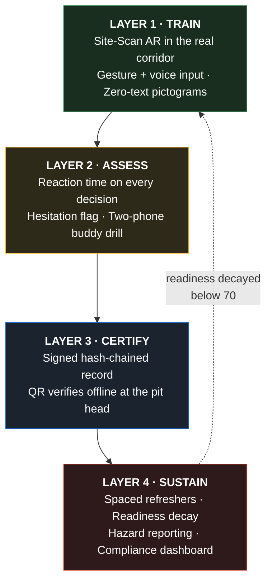
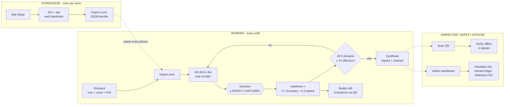
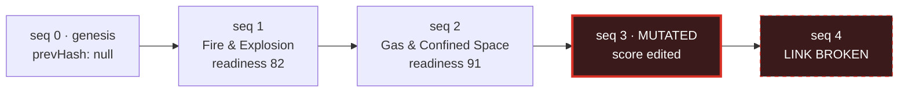
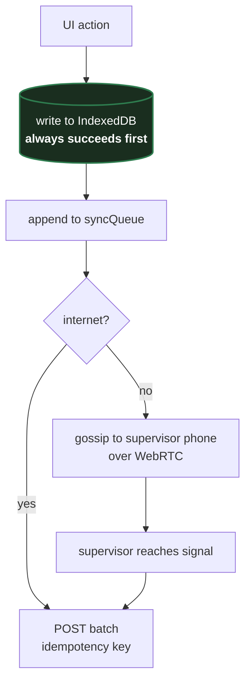

# Jaagruk — Presentation Pack

Everything you need to build the deck: slide-by-slide content, diagrams, the workflow, the
tech stack with justifications, a demo script, and prepared answers for the questions a
judging panel actually asks.

**SIH Problem Statement 26041** — AR-Based Vocational Training Simulator for Industrial
Safety in Jharkhand's Mining & Manufacturing Sector
**Organisation:** Government of Jharkhand, Department of Higher & Technical Education
**Project:** Jaagruk (जागरुक — *aware, alert, vigilant*)

> **How to use this file.** Each numbered section is one slide. The **Slide** block is what
> goes on screen — keep it sparse. The **Say** block is your speaker note, written the way
> you would actually talk. Do not read the slide aloud; the slide is the visual, you are the
> narration.

---

## Deck at a glance

| # | Slide | Purpose | Time |
|---|---|---|---|
| 1 | Title | Land the name and the one-line claim | 0:15 |
| 2 | The problem | Establish that people already know this is broken | 0:45 |
| 3 | Why the obvious build isn't enough | **The differentiator. This is the slide that wins.** | 1:15 |
| 4 | What Jaagruk is | The four layers in one picture | 0:45 |
| 5 | Layer 1 — Training | Train in the real corridor, glove-free, text-free | 1:00 |
| 6 | Layer 2 — Assessment | Time pressure and a real second human | 1:15 |
| 7 | Layer 3 — Certification | A certificate that cannot be quietly edited | 1:00 |
| 8 | Layer 4 — Intelligence | Decay, hazard sensing, compliance | 1:00 |
| 9 | End-to-end workflow | Three journeys: supervisor, worker, inspector | 1:00 |
| 10 | System architecture | How it fits together | 0:45 |
| 11 | Tech stack | What we used and why | 0:45 |
| 12 | Native → web fidelity | **Pre-empt the hardest question** | 0:45 |
| 13 | Offline-first data path | Prove the offline claim | 0:30 |
| 14 | Security & integrity | Signing, hashing, threat model | 0:30 |
| 15 | Language & accessibility | Hindi, Santali, zero-literacy | 0:45 |
| 16 | Built and verified | Scope evidence | 0:30 |
| 17 | Honest limitations | **Credibility play. Do not skip.** | 0:45 |
| 18 | Roadmap | Path to deployment | 0:30 |
| 19 | Impact | Why Jharkhand should fund this | 0:30 |
| 20 | Close | The one sentence to leave behind | 0:15 |

**Total ≈ 14 minutes** of talking. Trim slides 13–14 first if you are given 10 minutes.
Never trim slide 3 or slide 17.

---

## 1. Title

**Slide**

> # जागरुक / Jaagruk
> **Safety training that happens where the accident would.**
>
> SIH 26041 · Government of Jharkhand · Dept. of Higher & Technical Education
> *Team name · member names*

**Say**

> Jaagruk means aware. Not "trained" — aware. The gap between those two words is the entire
> problem we are solving, and I will show you why in about ninety seconds.

---

## 2. The problem

**Slide**

Three facts, one per line, large type:

> **Workers who know the right answer still freeze.**
> Knowing the evacuation route and executing it in four seconds are different skills.
>
> **Classroom safety retention collapses within a week.**
> A one-time induction makes the first exposure better, not stickier.
>
> **The buddy system is two humans coordinating under stress.**
> You cannot train that by yourself with a phone.

Footer: *Jharkhand — coal, mica, steel, manufacturing. DGMS-regulated sites, multilingual
workforce, patchy-to-absent connectivity underground.*

**Say**

> Safety training in this sector is not missing. It exists — inductions, posters, annual
> refreshers. The problem is that it produces a certificate rather than a reflex. A worker
> passes a written test in March, and in September a real gas alarm goes off and he stands
> still for eleven seconds trying to remember what he read. That eleven seconds is the whole
> problem, and nothing in the current system can even see it.

---

## 3. Why the obvious build isn't enough

**This is your most important slide.** Everyone in the room will have seen four submissions
that are AR overlay → quiz → QR certificate → dashboard. This slide says: we built that, and
then we kept going.

**Slide** — three-column table

| The real problem | What a quiz-and-certificate app does | What Jaagruk does |
|---|---|---|
| Workers who *know* the right action still freeze | Nothing. Right/wrong scoring cannot see hesitation. | **Every decision is timed** against a per-step baseline. Correct-but-slow is flagged for retraining instead of quietly passed. |
| Retention falls sharply within a week | Nothing. A one-time module improves first exposure, not retention. | **Readiness decays** with time since the last pass and recovers on a 90-second refresher. Certification is gated on today's score, not the test date. |
| The buddy system is two humans under stress | Simulates the buddy as an AI character — trains none of the coordination. | **Two real phones**, paired directly over WebRTC with no server and no internet. Scored on check-in discipline and how long you took to notice your buddy collapse. |

**Say**

> The baseline reading of this problem statement is: AR overlay, quiz, QR certificate,
> dashboard. That is correct scope, and it is also what most submissions will be. It leaves
> the three things that actually cause the deaths untouched.
>
> Left column is the real failure. Middle column is what a quiz app does about it — nothing,
> in all three rows. Right column is what we built. Timed decisions, decaying readiness, and
> a buddy drill that needs an actual second human.
>
> Everything else in this deck is implementation detail. This is the idea.

---

## 4. What Jaagruk is

**Slide** — the four-layer diagram

```
┌──────────────────────────────────────────────────────────────────────┐
│  LAYER 1 · TRAIN                                                      │
│  Site-Scan AR in the worker's real corridor · glove-friendly gesture   │
│  and voice input · zero-text pictogram mode (ISO 7010)                 │
└───────────────────────────────┬──────────────────────────────────────┘
                                ▼
┌──────────────────────────────────────────────────────────────────────┐
│  LAYER 2 · ASSESS                                                     │
│  Reaction time on every decision · hesitation flag · two-phone buddy   │
│  drill over WebRTC, scored on coordination                             │
└───────────────────────────────┬──────────────────────────────────────┘
                                ▼
┌──────────────────────────────────────────────────────────────────────┐
│  LAYER 3 · CERTIFY                                                    │
│  Signed, hash-chained record per site · QR carries the whole record    │
│  so an inspector verifies it offline at the pit head                   │
└───────────────────────────────┬──────────────────────────────────────┘
                                ▼
┌──────────────────────────────────────────────────────────────────────┐
│  LAYER 4 · SUSTAIN                                                    │
│  Spaced refreshers · readiness decay · near-miss hazard reporting ·    │
│  compliance dashboard with statutory export                            │
└──────────────────────────────────────────────────────────────────────┘
         Every layer works with the network cable pulled out.
```

**Say**

> Four layers. Train, assess, certify, sustain. The fourth one is the one that makes the
> other three matter — without decay and refreshers you have built a better version of the
> thing that already fails.
>
> One phone. No headset. No signal required.

---

## 5. Layer 1 — Training

**Slide**

> ### Train in the corridor you would actually run down
>
> **Site-Scan AR.** A supervisor walks the real zone once and aims the phone at each
> landmark — exit, extinguisher, gas zone, assembly point, LOTO panel, first aid. Each
> anchor stores the **magnetic bearing and elevation** of that sighting.
> During a drill, markers reproject at those bearings, so *"the exit is left past the second
> pillar"* is learned against real geometry.
> One walkthrough exports as a small JSON bundle and seeds every worker's phone.
>
> **Glove-friendly input.** Point-to-aim and pinch-to-select via MediaPipe hand tracking,
> with a **1.2-second dwell ring** as the precision fallback — because heavy gloves are
> exactly what removes pinch precision. Voice answers run in parallel. Touch always works.
>
> **Zero-text pictogram mode.** ISO 7010 sign geometry and colour semantics — the same shapes
> already painted on a DGMS-regulated mine wall — plus audio narration. 39 inline SVG
> pictograms, no image files. Onboarding itself is icon-and-voice driven, so a worker who
> cannot read selects a language and logs in unaided.

Visual: side-by-side phone mockups — camera view with a green EXIT marker over a real
doorway, and the same drill in pictogram mode.

**Say**

> Generic AR training teaches a generic corridor. That transfers poorly, because under stress
> you do not recall a diagram, you recall a place.
>
> So the supervisor scans the actual zone once. He points the phone at the real exit and taps.
> We store the compass bearing and the tilt. When a worker runs the drill in that corridor,
> the marker sits over the real exit, and stays there as he turns.
>
> Three things about the input, because this is a gloved workforce in bad light. Pinch to
> select is fast if your hands are free. Gloves take that away, so there is a dwell ring —
> hold still for just over a second. And touch never stops working. We never remove a working
> input to show off a clever one.

---

## 6. Layer 2 — Assessment

**Slide**

> ### Scored the way an emergency scores you
>
> ```
> readiness = 0.7 × accuracy  +  0.3 × speed
> ```
> Speed only counts on decisions that were **correct**. Fast and wrong earns nothing.
>
> | Grade | Condition | Speed score |
> |---|---|---|
> | `fast` | within the step's target | 100 |
> | `normal` | within 2× target | 70 |
> | `slow` | beyond 2× target | 35 → **hesitation flag** |
> | `incorrect` | any speed | retrain regardless |
>
> **Targets are set per step by how much time the real situation allows** — 6 s for an
> escalating fire or a burning smell at a panel; 13 s for a judgement call about a colleague's
> persistent cough. Rewarding a snap answer on the second one would train the wrong instinct.
>
> **Buddy drill.** Two phones pair by scanning each other's QR codes — WebRTC data channel,
> no server, no internet. A confined-space entry runs as a shared state machine with a
> scripted distress event. The responder is scored on whether they noticed, how fast, and
> **whether they resisted going in unprotected** — the decision that turns one casualty
> into two.

Visual: the live latency bar mid-decision (`4.2s / 9s`, amber), and two phones showing the
paired drill.

**Say**

> Seventy-thirty, accuracy to speed. And the speed component only counts on answers that were
> right, because fast and wrong is not a partial success, it is the actual failure mode.
>
> The interesting output is not the score. It is the hesitation flag. A worker who gets every
> answer correct but takes three times as long as the window on two of them passes a
> conventional quiz and shows up on our dashboard as a retraining candidate. That worker is
> exactly who freezes in September.
>
> The targets are not one global number. An escalating fire gives you six seconds because
> every second is smoke in your lungs. A colleague mentioning a cough gets thirteen, because
> that is an occupational health decision and snap-judging it is wrong. That calibration is
> per step, in the code, with the reasoning written next to it.
>
> And the buddy drill is two real phones. Simulating the buddy with an AI trains none of the
> coordination, which is the part that fails.

---

## 7. Layer 3 — Certification

**Slide**

> ### A certificate that cannot be quietly edited
>
> ```
> record = { v, workerId, workerName, moduleId, domain, score, readiness,
>            latencyGrade, timestamp, siteId, seq, prevHash }
>
> canonical JSON ──► SHA-256 ──► hash ──► signed by device key
> every record embeds the previous record's hash  ──►  per-site append-only chain
> ```
>
> **Verification reports four independent signals**, never collapsed into one badge:
> 1. Is the record intact and correctly signed?
> 2. Is the signer known to this phone?
> 3. Is the record present in this phone's ledger?
> 4. Does it link correctly to its predecessor?
>
> Detects: broken link · mutated payload · bad signature · unknown signer · sequence gap · fork
>
> The QR carries the **entire signed record** (~376 characters), so an inspector verifies at
> the pit head with no signal and no copy of the ledger.
>
> ⚠️ **This is a tamper-evident hash-chained ledger, not a blockchain.** No consensus, no
> mining, no distributed agreement. Calling it a blockchain would be inaccurate.

Visual: chain-of-blocks diagram with one block tinted red and a "link broken at seq 4" callout.

**Say**

> Every certificate embeds the hash of the one before it, and is signed by the device that
> issued it. Change any field in any record and every subsequent link fails. You cannot edit
> one entry without rewriting the chain, and the chain is on multiple phones.
>
> Verification reports four separate answers instead of one green tick, because the
> interesting cases live in the gaps. A record can be perfectly signed and genuine but come
> from a device this phone has never trusted. That is a different situation from a forgery,
> and an inspector needs to be able to tell them apart.
>
> And I want to be precise about the last line. This is a hash-chained ledger. It is not a
> blockchain, and we do not call it one. There is no consensus mechanism here, and claiming
> otherwise in front of anyone who knows the space would cost us more than it gains.

---

## 8. Layer 4 — Intelligence

**Slide**

> ### Keeping it true after the certificate prints
>
> **Spaced refreshers** at 2, 7, 21 and 60 days per domain. A pass resets the clock; a fail
> resets the interval.
>
> **Readiness decays** — full value for 7 days, then declining to a **0.55 floor at 90 days**.
> Certification requires *effective* (decayed) readiness ≥ 70 in each of the 5 domains, so a
> certificate means competence **today**, not a date stamp from March.
>
> **Near-miss hazard reporting.** One photo, one tap. Tagged by zone and compass bearing,
> because GPS does not work underground. Voice note instead of typing, because a worker who
> cannot comfortably write Hindi can absolutely describe what he saw. Queues locally, syncs
> when it can.
>
> **Compliance dashboard** — hesitation-risk list, hazard triage with bearing clusters,
> ledger integrity panel, QR verify tool, and CSV export formatted for **Mines Act 1952 /
> Factories Act 1948** record-keeping.

Visual: the decay curve crossing the 70% pass line, with the "refresh here" marker.

**Say**

> This is the layer that makes the difference between a demo and a system.
>
> Readiness is not stored as a number from the day you passed. It decays. Full value for a
> week, then it slides, floored at 55 percent around the ninety-day mark. To stay certified you
> have to keep it above 70, and a ninety-second refresher pulls it back up.
>
> That flips the incentive. A conventional certificate rewards passing once. This one rewards
> staying sharp, and it tells a safety officer who is drifting *before* the audit.
>
> And every worker you train becomes a sensor. Photo, tap, voice note, tagged by bearing
> because GPS is useless in a shaft. It lands on the safety officer's board.

---

## 9. End-to-end workflow

**Slide** — three swimlanes

```
SUPERVISOR (once per zone)
  Site Setup ──► aim phone at exit, tap ──► aim at extinguisher, tap ──► ...
       │              (stores bearing + elevation + thumbnail)
       └──► export zone bundle (JSON)  ──────────────┐
                                                     │
WORKER (every shift / every refresher)               ▼
  Onboard (icon + voice, PIN) ──► import zone ──► pick module
       │
       ├──► AR drill in the real corridor ──► decision ──► LATENCY CAPTURED
       │                                          │
       │                                    grade: fast / normal / slow
       │                                          │
       ├──► readiness = 0.7·accuracy + 0.3·speed  │
       │                                          ▼
       ├──► buddy drill (2nd phone, QR pair) ──► coordination score
       │
       ├──► all 5 domains ≥ 70 effective? ──► ISSUE CERTIFICATE
       │                                        │
       │                                  sign + chain + QR
       │
       ├──► spot a real hazard ──► photo + voice + bearing ──► queue
       │
       └──► 2 / 7 / 21 / 60 days later ──► refresher due ──► readiness restored

INSPECTOR / SAFETY OFFICER
  Scan worker's QR ──► verify offline ──► 4 signals reported
  Admin dashboard ──► hesitation-risk list · hazard triage · chain integrity
       └──► CSV export (Mines Act 1952 / Factories Act 1948)

SYNC (whenever, never blocking)
  local write ──► queue ──► internet? POST batch
                        └─ no internet? gossip to supervisor phone over WebRTC
                              └─ supervisor reaches signal later ──► POST batch
```

**Say**

> Three journeys. The supervisor does a one-time walkthrough per zone and exports it. That
> bundle seeds every worker's phone, so the expensive part happens once.
>
> The worker onboards with icons and voice, imports the zone, and trains in the actual
> corridor. Every decision is timed. When all five domains clear 70 effective, a certificate
> is signed and chained.
>
> The inspector scans a QR at the pit head with no signal and gets four independent answers.
> The safety officer gets the hesitation list, which is the artefact nobody currently has.
>
> Sync is the bottom lane, and it never blocks anything. Local write always succeeds first.

---

## 10. System architecture

**Slide**

```
┌─────────────────────────────────────────────────────────────────────────┐
│  PRESENTATION            React 18 · React Router · Tailwind             │
│  13 routes · 14 pages · 10 components                                   │
│  ARDrill · DrillUI · Charts · GestureLayer · PeerSync · QrScanner        │
├─────────────────────────────────────────────────────────────────────────┤
│  DOMAIN LOGIC (src/lib — 25 modules, pure and testable)                  │
│                                                                          │
│  TRAIN            ASSESS           CERTIFY          SUSTAIN              │
│  siteMap.js       assessment.js    chain.js         spaced.js            │
│  gesture.js       drills.js        certificate.js   hazards.js           │
│  speech.js        scenarioMeta.js  crypto.js        sync.js              │
│  pictograms.jsx                    identity.js      charts.js            │
│                                                                          │
│  SHARED           num.js (strict numeric coercion) · idb.js · local.js    │
│                   i18n.js + i18nJaagruk.js (6 languages, ~430 keys)      │
├─────────────────────────────────────────────────────────────────────────┤
│  PLATFORM CAPABILITIES (browser / WebView)                               │
│  IndexedDB   Web Crypto   WebRTC     getUserMedia  DeviceOrientation     │
│  (ledger)    (sign/hash)  (P2P)      (camera)      (compass/pitch)       │
│  Web Speech  MediaPipe WASM   Service Worker + Workbox (offline shell)   │
├─────────────────────────────────────────────────────────────────────────┤
│  PACKAGING       Capacitor 8 → Android APK (minSdk 29)                   │
│                  in.gov.jharkhand.jaagruk · also installable PWA         │
└─────────────────────────────────────────────────────────────────────────┘
                              No backend. No account. No server dependency.
```

**Say**

> Three tiers and a packaging step. The important architectural decision is the middle one:
> all the domain logic — bearing maths, latency grading, the hash chain, decay curves — lives
> in plain modules with no React and no DOM in them. That is why we could develop it against
> executable checks and why the same logic runs identically in a browser, in the WebView, and
> in a Node script.
>
> The bottom tier is entirely platform capability. There is no backend in this submission, and
> that is a design decision, not a shortcut — a system that needs a server to certify a worker
> cannot certify a worker two hundred metres underground.

---

## 11. Tech stack

**Slide**

| Layer | Choice | Why this and not the alternative |
|---|---|---|
| UI | **React 18 + Vite + Tailwind** | Single codebase → APK, PWA, and browser demo. Vite build is ~8 s, so iteration is not the bottleneck. |
| Packaging | **Capacitor 8** (Android, minSdk 29) | Wraps the same build as a real APK without a second codebase. Meets the "working APK" deliverable. |
| Local database | **IndexedDB** (`jaagruk` v1, 9 stores) | The Room equivalent on web. Structured, indexed, quota-aware, holds blobs (photos, voice notes, ML model). |
| Crypto | **Web Crypto** — Ed25519 → ECDSA P-256 → HMAC ladder | Native, audited primitives. Ed25519 where available; automatic fallback down the ladder rather than failing on older WebViews. PIN hashing is PBKDF2, 210 000 iterations. |
| AR overlay | **getUserMedia + DeviceOrientationEvent** | Camera passthrough with compass/pitch anchoring. No plugin, no ARCore dependency, runs on any Android 10+ phone. |
| Hand tracking | **@mediapipe/tasks-vision** (WASM) | Same model family as native MediaPipe Hands. Loaded from CDN at runtime and cached, so it never inflates the base bundle. |
| Peer-to-peer | **WebRTC RTCDataChannel + QR signalling** | No signalling server and no internet. Offer/answer compressed with `deflate-raw` (885 → 476 chars) so it fits a scannable QR. |
| Voice | **Web Speech API** | Synthesis and recognition with per-language locale mapping and a fixed command lexicon with fuzzy matching. |
| Offline shell | **Service worker + Workbox** (`vite-plugin-pwa`) | 11 precached entries, ~1.6 MB. App boots with no network on first cold start after install. |
| 3D fallback | **three.js + React Three Fiber** | For phones with no usable camera or compass, the drill runs as a 3D scene rather than refusing to start. |
| Charts | **Hand-rolled inline SVG** | No charting library. Bundle already carries three.js, and these must render offline with zero runtime deps. |

**Deliberately not used:** any backend, any auth provider, any charting library, any state
management library, any component library, any blockchain.

**Say**

> Two choices worth defending.
>
> First, the charts are hand-written SVG. Adding Recharts would have been forty lines less
> work and a hundred-odd kilobytes more bundle, on a device that may be a four-year-old
> Android on a 2G link. Geometry is separated from rendering, so the maths is pure and the
> components are thin.
>
> Second, MediaPipe loads from CDN at runtime rather than being bundled. Hand tracking is
> opt-in — most workers will never enable it — so making every user download the model would
> be the wrong default. It caches after first use.
>
> And the bottom line matters as much as the table: no backend, no auth provider, no
> blockchain. Every one of those would have been easy to add to a slide and hard to justify.

---

## 12. Native → web fidelity

**Put this slide in. It pre-empts the hardest question you will get.**

**Slide**

> ### The reference design was Kotlin + ARCore + Room + Nearby Connections. Here is exactly what our substitution costs.

| Component | Native design | Jaagruk | Fidelity |
|---|---|---|---|
| Site-Scan AR | ARCore Depth + Cloud Anchors | Camera + compass/pitch bearing anchors | **Functional for orientation-anchored overlay.** No depth mesh, no occlusion, no translational tracking. |
| Gesture input | MediaPipe Hands (TFLite) | `@mediapipe/tasks-vision` (WASM) | **Full** — same model family |
| Local DB | Room / SQLite | IndexedDB, versioned, quota-aware | **Full** |
| Buddy pairing | Nearby Connections (Wi-Fi Direct + BT) | WebRTC + QR signalling | **Functional.** Needs a shared LAN or hotspot; Nearby brings its own radio. |
| Cert signing | Ed25519 via Tink + Android Keystore | Web Crypto Ed25519, non-extractable key in IndexedDB | **Full crypto, weaker key isolation** — no hardware keystore. |
| Deferred sync | WorkManager | IndexedDB queue + `online` event + Background Sync | **Functional** |
| Hindi voice | Vosk offline model | Web Speech, `hi-IN`, fixed lexicon | **Partial** — OEM WebView may use a network recogniser |
| Santali voice | Custom TFLite keyword spotter | Fixed lexicon on the `hi-IN` acoustic model | **Partial by design** — no production Santali ASR exists |
| Refresher alarms | AlarmManager exact alarms | Computed on device, surfaced on open + `periodicSync` | **Partial** — the web platform cannot wake a closed page |

**What the trade buys:** one codebase that ships as an Android APK, installs as a PWA on a
shared site tablet, and runs in a judge's browser with nothing to install.

**Say**

> Someone in this room is going to ask why this isn't native, so let me answer it before you
> do.
>
> The reference architecture for this problem statement is Kotlin and ARCore. We implemented
> the same four layers on web and packaged it with Capacitor. That costs us two real things:
> ARCore's depth mesh, so our markers hold direction but do not occlude behind a real pillar;
> and the hardware keystore, so our private keys are non-extractable browser handles rather
> than TEE-backed.
>
> What it buys is that the same build is an APK, a PWA on a shared tablet, and a browser demo.
> For a government pilot across multiple sites with mixed device estates, that distribution
> story is worth more than depth occlusion.
>
> That whole table is in the repository, with the fidelity column filled in honestly. We did
> not write "full" where it isn't.

---

## 13. Offline-first data path

**Slide**

```
UI action
  └─► write to IndexedDB          ← always succeeds first, never blocks on network
        └─► append to syncQueue
              ├─ internet ────────► POST batch (idempotency key)
              └─ no internet ─────► gossip to nearby supervisor phone over WebRTC
                                      └─► supervisor reaches signal ──► POST batch
```

> Every write is **local-first, timestamped and additive**. Records are keyed by content
> hash, so replaying a batch is always safe. Sync is eventual and idempotent.
>
> **Storage stores (IndexedDB `jaagruk` v1):** `workers` · `chain` · `keys` · `attempts` ·
> `schedule` · `sites` · `hazards` · `syncQueue` · `blobs`
> Small synchronous settings (language, active session, toggles) stay in `localStorage`.
>
> Storage pressure is handled, not assumed: quota errors surface to the user as
> "held for this session only, ask your supervisor to sync" rather than silently dropping
> a hazard report.

**Say**

> The rule is that the local write always wins and always happens first. Nothing in the
> training, assessment, certification or verification path waits on a network call.
>
> When there is no signal at all — which underground is the normal case, not the edge case —
> records gossip phone to phone over the same WebRTC transport the buddy drill uses. The
> supervisor's phone accumulates them and flushes upward when it surfaces.
>
> And because every record is keyed by its content hash, replaying a batch is harmless. That
> is what makes eventual sync safe rather than a source of duplicates.

---

## 14. Security & integrity

**Slide**

| Concern | How it is handled | Honest boundary |
|---|---|---|
| Certificate forgery | SHA-256 over canonical JSON, signed by device key, chained by `prevHash` | — |
| Silent edit of a past record | Breaks every subsequent link; verification names the failing seq | — |
| Unknown issuer | Verification reports "signer not trusted by this phone" separately from "invalid" | Trusting a new signer is an explicit supervisor prompt, never a silent default |
| Worker identity | PIN, hashed with PBKDF2 (210 000 iterations) + per-worker salt, lockout after repeated failures | **Device-local identity, not an authorization boundary** |
| Supervisor access | Local PIN gate on `/admin` | **Not real authorization.** Production needs server-issued JWTs with RBAC |
| Key storage | Non-extractable Web Crypto handle in IndexedDB | **No hardware keystore.** Clearing site data destroys the device key — which is exactly why records gossip to a second device |
| Data at rest | On-device only; no telemetry, no third-party analytics | Photos and voice notes never leave the device until an explicit sync |

**Say**

> Two honest boundaries here, and I would rather say them than have them found.
>
> The PIN is device-local identity. It stops a colleague from casually taking your drill. It
> is not an authentication system, and the admin PIN is not real authorization — a production
> deployment needs server-issued credentials with role-based access.
>
> The keys are non-extractable browser handles, not hardware-backed. That means clearing site
> data destroys the device key, which is precisely why the chain gossips to a second device.
> The redundancy is the mitigation.
>
> What *is* solid is the integrity story. You cannot alter a certificate without breaking the
> chain, and the chain exists in more than one place.

---

## 15. Language & accessibility

**Slide**

> ### Built for a workforce that is multilingual and not uniformly literate
>
> **Six languages:** English · हिन्दी Hindi · ᱥᱟᱱᱛᱟᱲᱤ Santali (Ol Chiki) · বাংলা Bengali ·
> ଓଡ଼ିଆ Odia · اردو Urdu
> ~430 UI keys. Hindi, Bengali, Odia, Urdu at **100%**. Santali at **~38%** and
> **flagged in-app as unverified** — coverage is *measured at runtime*, not claimed on a slide.
>
> **Zero-literacy path is a real path, not a mode toggle:**
> - Onboarding is icon-and-voice driven — a worker who cannot read selects a language by
>   hearing it spoken and logs in with a PIN pad
> - 39 ISO 7010-style inline SVG pictograms, matching the signage already on the wall
> - Audio narration of every prompt and every choice
> - **No pictogram on a choice button reveals the answer** — enforced by a check
>
> **Accessibility:** every animation honours `prefers-reduced-motion`; charts carry text
> alternatives rather than relying on colour; the AR view says *"turn around"* in words when
> every marker is behind you, not just a small chevron.

**Say**

> Six languages, and the honest part is the Santali number. It is at about 38 percent and the
> app says so, in the app, at runtime — we measure coverage rather than asserting it. It was
> written by a non-native speaker as a starting point and it needs review by a Santali speaker
> before anyone deploys this. Saying "fully localised" would have been one word on a slide and
> a serious problem in a pilot.
>
> The part I am more pleased with is that the zero-literacy path is complete end to end. Not a
> pictogram mode bolted onto a text app — the onboarding itself works if you cannot read. You
> hear the language names spoken and pick one.
>
> And one detail that matters more than it sounds: no icon on a choice button gives away which
> choice is correct. It would be very easy to accidentally put a green tick on the safe option
> and turn a safety assessment into a colour-matching exercise.

---

## 16. Built and verified

**Slide**

| Deliverable required | Status |
|---|---|
| Working Android APK | Capacitor project configured, `minSdk 29`, `in.gov.jharkhand.jaagruk` |
| ≥ 2 complete AR training modules | **6 modules, 18 timed decisions**, covering all 5 named domains + a bonus manual-handling module |
| Assessment engine | Accuracy + latency grading, hesitation detection, decaying readiness |
| QR certificate + verification | Signed hash-chained ledger; QR carries the whole record for offline verify |
| Hindi + Santali localisation | 6 languages; Santali in Ol Chiki, partial and flagged |
| Offline functionality | Train, assess, certify, verify — all with no network |
| Web admin compliance dashboard | Compliance, hesitation-risk list, hazard board, chain integrity, QR verify, statutory CSV |

> **Codebase:** 53 source files, ~18 700 lines. Domain logic 9 700 lines across 25 pure
> modules; 14 pages; 10 components; 13 routes.
> **Build:** 690 modules, no warnings. ~1.6 MB precached across 11 entries.

**Say**

> Six modules, not the two required, covering all five named domains plus manual handling.
> Eighteen individually timed decisions.
>
> The number I would point at is 9 700 lines of domain logic in pure modules. That is the
> part that had to be right, and it is the part that could be developed against executable
> checks — SHA-256 cross-checked against Node's own implementation, RFC 4231 HMAC vectors,
> chain tamper and fork detection, bearing maths across the 359-to-0-degree seam.
>
> That is also how we found the two bugs I would rather tell you about than hide.

---

## 17. Honest limitations

**Do not skip this slide.** It converts "students who overclaim" into "team that knows its
own system." Panels reward it.

**Slide** — pick 6 for the slide, keep the rest for Q&A

> 1. **No depth or SLAM.** Markers anchor to bearing and elevation, not a 3D mesh. They hold
>    direction as you turn but do not occlude behind real geometry. *ARCore Depth + Cloud
>    Anchors is the upgrade path.*
> 2. **Magnetometer drift.** Steel plants and shafts distort magnetic heading. The app detects
>    relative-only heading and offers manual re-centring — a sensor limit, not a software one.
> 3. **No production Santali ASR exists.** Santali text and audio *output* are real; Santali
>    voice *input* matches a fixed lexicon against a Hindi acoustic model.
> 4. **Santali translations are unverified** and need native-speaker review. Flagged in-app.
> 5. **PIN is device-local identity, not authorization.** Production needs server-issued
>    credentials with RBAC.
> 6. **Reaction-time baselines are reasoned, not yet measured** against a worker cohort. They
>    are deliberately generous, because over-flagging hesitation would erode trust in the flag.
>
> *Also documented in the repo:* no hardware keystore · the web platform cannot wake a closed
> page on a schedule · buddy drill needs a shared LAN or hotspot · AI hazard scan needs
> connectivity and a user-supplied key · no DGMS server in this submission (client sync half
> is complete; shipped path is a signed export bundle).

**Say**

> I want to spend thirty seconds on what this does not do, because you will find it anyway and
> it is better coming from me.
>
> We do not have depth sensing. Our markers hold their direction as you turn, but they will
> not hide behind a real pillar. That needs ARCore and it is the first thing native buys us.
>
> There is no production-quality Santali speech recognition in existence. We did not fake one.
> Santali output is real; Santali voice input is a fixed lexicon on a Hindi acoustic model, and
> the app says so.
>
> And the reaction-time baselines are reasoned rather than measured. We set them from what the
> situation allows, deliberately on the generous side, because a hesitation flag that fires too
> often is a flag people learn to ignore. Calibrating those against a real cohort is the first
> thing a pilot should produce.

---

## 18. Roadmap

**Slide**

| Phase | Work | Unlocks |
|---|---|---|
| **Pilot** (0–3 mo) | One site, one ITI. Native-speaker Santali review. Measure real reaction times across a cohort. | Calibrated baselines; verified translations |
| **Harden** (3–6 mo) | DGMS-side sync server + server-issued credentials with RBAC. Hardware-backed keystore via a Capacitor plugin. | Real authorization; audit-grade key custody |
| **Native AR** (6–12 mo) | ARCore Depth + Persistent Cloud Anchors for the overlay; Nearby Connections for pairing without shared LAN. | Occlusion, translational tracking, radio-independent pairing |
| **Scale** (12 mo+) | Multi-site fleet management, statutory reporting integration, module authoring for site-specific hazards. | State-wide deployment |

**Say**

> The ordering here is deliberate. The first phase is not more features, it is calibration and
> translation review — the two things we have honestly flagged as unverified. You cannot
> harden a system whose baselines you have not measured.
>
> Native AR is phase three, not phase one, because occlusion is a fidelity improvement and
> server-side authorization is a correctness requirement. We would fix the second first.

---

## 19. Impact

**Slide**

> **For the worker** — trains in his own corridor, in his own language, without needing to
> read. Learns the route he would actually run.
>
> **For the safety officer** — a hesitation-risk list, which is a category of information that
> does not currently exist anywhere. Plus a live hazard board fed by every trained worker.
>
> **For the site** — certification that reflects competence today, not a date in March. Near-
> miss reporting with no friction, so hazards surface before they escalate.
>
> **For the State / DGMS** — tamper-evident records verifiable offline at the pit head, and
> statutory export aligned to Mines Act 1952 and Factories Act 1948 record-keeping.
>
> **Cost to deploy:** one Android phone per worker (already in their pocket), one supervisor
> walkthrough per zone, no headset, no server, no connectivity requirement.

**Say**

> The line I would leave you with is the last one. There is no hardware to buy. No headset, no
> server, no connectivity. One supervisor walkthrough per zone, and after that it runs on the
> phone the worker already owns, two hundred metres underground, in Santali if that is what he
> speaks.

---

## 20. Close

**Slide**

> # जागरुक
> ### Not "trained in March."
> ### Aware today.
>
> *repo · team · contact*

**Say**

> A certificate says a worker was trained. Jaagruk says whether he is ready — and it can tell
> you that this morning, on a phone, with no signal. Thank you.

---

# Appendix A — Live demo script

**Six minutes, in this order.** Rehearse it until you are not narrating your own clicking.
Have the app already open on the Home screen before you start talking.

| # | Do this | Say this | Why this order |
|---|---|---|---|
| 1 | Home → switch language to **हिन्दी**, then to **ᱥᱟᱱᱛᱟᱲᱤ** | "Six languages. Watch the coverage notice appear on Santali — the app tells you it is partial rather than pretending." | Localisation honesty, in ten seconds, without a slide |
| 2 | Toggle **pictogram mode** on | "Now no text at all. ISO 7010 shapes — the same signage already painted on the wall. Audio narrates every prompt." | Zero-literacy path is real |
| 3 | Start **Fire & Explosion Response** | "Three decisions. Watch the bar under the prompt." | Sets up the latency reveal |
| 4 | **Answer the first step deliberately slowly** — count to twelve | "I know the answer. I am taking twelve seconds. A conventional quiz scores me 100%." | **This is the money moment of the demo** |
| 5 | Let the feedback panel land | "Correct — and flagged. `4.2s / 9s` on the pill, hesitation recorded. This worker passes a written test and freezes in a real evacuation." | Delivers the core differentiator live |
| 6 | Finish the module, go to **Dashboard** | "Readiness ring, radar across five domains, and the decay curve — this is what happens to my readiness if I never come back." | Shows the sustain layer visually |
| 7 | Point at the **decay curve crossing 70%** | "The app is telling me the date I stop being certified — about six weeks out at this score. Ninety seconds of refresher resets it." | Makes decay concrete, not abstract. *Read the actual number off the screen, do not quote one from memory.* |
| 8 | Go to **Certification** → issue → show the **QR** | "The whole signed record is in this QR. Not a lookup ID — the record." | Sets up offline verification |
| 9 | **Turn wifi off**, scan the QR on `/verify` | "No network. Four independent signals: intact, signer known, in ledger, links correctly." | **Proves the offline claim physically** |
| 10 | On `/verify`, edit one character of the payload and re-verify | "One character. Link broken at that sequence number." | Proves tamper-evidence, not just claims it |
| 11 | If two phones available: **Buddy drill** | "Two real phones, QR pairing, no server. He is scored on how long he took to notice I collapsed." | Otherwise use *Practise on one device* in a second tab |
| 12 | **Admin** → hesitation-risk list | "This list is the artefact no safety officer currently has: people who passed and should not have." | Lands the value for the buyer, not just the user |

**Fallbacks, decided in advance:**

- **No camera permission on the venue laptop** → the drill runs in 3D fallback mode. Say
  *"this is the path for phones with no usable camera — it degrades, it does not refuse."*
- **Only one device** → *Practise on one device* + a second browser tab. Say clearly that it
  is labelled as practice, not the real two-person exercise. Do not pretend it is two phones.
- **Compass unavailable on a laptop** → show Site Setup and the exported zone JSON instead of
  live anchoring, and explain that bearing capture needs a phone.
- **Demo dies entirely** → you still have slides 3, 6 and 17. Talk through the twelve-second
  hesitation story verbally; it survives without the app.

**Do not:** live-code, apologise for the UI, open DevTools, or say "normally this works."

---

# Appendix B — Q&A preparation

Ordered by how likely you are to be asked. Answer in two sentences, then stop.

### "Why isn't this native Kotlin/ARCore?"
One codebase ships as an APK, a PWA on a shared site tablet, and a browser demo — for a
government pilot with a mixed device estate that distribution story outweighs depth occlusion.
Slide 12 lists every substitution and what it costs; ARCore Depth is our phase-three upgrade,
and we did not write "full fidelity" where it isn't true.

### "Is this a blockchain?"
No, and we are careful not to call it one. It is a tamper-evident hash-chained ledger — signed
records, each embedding the previous hash — with no consensus, no mining and no distributed
agreement. Adding those words would be inaccurate.

### "How is this actually AR without ARCore?"
Camera passthrough plus the magnetometer and accelerometer, so an anchor is a *direction* — a
bearing and an elevation — rather than a 3D point. Markers stay over the real exit as the
worker turns, which is the property that makes training transfer; what we give up is occlusion
and surviving large translation.

### "What if the magnetometer is wrong? It is a steel plant."
That is a real constraint and we detect it rather than ignore it: when absolute heading is
unavailable we fall back to gyro-relative mode with an explicit re-centre control and tell the
worker which mode he is in. Showing a marker confidently in the wrong place would be worse than
admitting the sensor is degraded.

### "Where did the reaction-time targets come from?"
From what each situation allows — six seconds for an escalating fire, thirteen for a judgement
call about a colleague's cough — with the reasoning written next to each value in the code.
They are reasoned, not yet measured against a cohort, and deliberately generous, because a
hesitation flag that fires too often is one people learn to ignore.

### "How do you stop workers from just memorising answer positions?"
That was a real bug we found and fixed: the safe answer was the second choice in all eighteen
steps, so anyone who noticed could score 100% without reading. Choices are now shuffled per
attempt with a seeded, render-stable permutation — stable so the buttons never reorder under a
worker's thumb mid-decision.

### "What stops a supervisor issuing fake certificates?"
Nothing stops a supervisor certifying his own worker — that is a process control, not a software
one. What the software guarantees is that the record cannot be *altered afterwards* and that its
issuing device is identifiable: a certificate signed by an untrusted key is reported as exactly
that, separately from "invalid."

### "Does the buddy drill need internet?"
No — WebRTC data channel with the offer and answer exchanged by scanning QR codes, so there is
no signalling server and no internet. It does need both phones on a shared LAN or hotspot,
which is the one thing Nearby Connections would give us for free.

### "What happens if the worker's phone is wiped?"
The device key and local ledger are gone, which is precisely why records gossip to a second
device — usually the supervisor's phone — and flush upward when anything sees the internet. The
worker's certificates survive on the chain even though that phone's signing key does not.

### "Six languages — are they real translations or machine output?"
Hindi, Bengali, Odia and Urdu are complete. Santali is at about 38%, written in Ol Chiki by a
non-native speaker as a starting point, and the app measures and displays that coverage at
runtime rather than claiming completeness — native-speaker review is the first pilot task.

### "How much would this cost to deploy?"
No hardware: no headsets, no server, no connectivity requirement. One supervisor walkthrough
per zone as a one-time setup cost, then it runs on phones workers already own.

### "What is the single weakest part of this?"
That the reaction-time baselines are unmeasured. Everything else is either complete or has a
documented upgrade path; that one needs contact with real workers before the hesitation flag
can be trusted as an operational signal rather than an indicator.

### "Did you test it?"
Domain logic was developed against executable checks — SHA-256 cross-checked against Node's
own implementation including multi-byte UTF-8, RFC 4231 HMAC vectors, chain tamper/fork/link
detection, latency and decay boundaries, and bearing maths across the 359°/0° seam. It found
three real bugs, all documented in the README, including one that had been silently corrupting
compass readings.

---

# Appendix C — Diagram sources

Paste into [mermaid.live](https://mermaid.live) or draw.io, export PNG, drop into the slide.

### C1 · Four-layer overview (slide 4)



The dotted feedback edge is the important part of this diagram — it is what makes the system a
loop rather than a funnel. Point at it.

### C2 · End-to-end workflow (slide 9)



### C3 · Certification chain (slide 7)



Caption: *Edit any field in any record and every subsequent link fails. Verification names the
exact sequence number.*

### C4 · Offline sync path (slide 13)



### C5 · Readiness decay (slide 8) — plot these points

The curve is **flat for 7 days, then linear** down to a 0.55 floor at day 90:

```
decayFactor(d) = 1                              for d ≤ 7
               = 1 − 0.45 × (d − 7) / 83        for 7 < d < 90
               = 0.55                           for d ≥ 90
```

Worked example from a base readiness of **88**:

| Days since pass | Decay factor | Effective readiness |
|---|---|---|
| 0 | 1.000 | 88 |
| 7 | 1.000 | 88 ← grace window ends |
| 14 | 0.962 | 85 |
| 21 | 0.924 | 81 |
| 30 | 0.875 | 77 |
| 45 | 0.794 | **70 ← last day still certified** |
| 46 | 0.789 | **69 ← certification lapses** |
| 60 | 0.713 | 63 |
| 75 | 0.631 | 56 |
| 90 | 0.550 | 48 (floor) |

Draw a horizontal line at 70 and mark the day-45/46 crossing. That crossing is the entire
argument for the fourth layer — put an arrow on it labelled *"90 seconds of refresher resets
this."*

Note the shape is deliberately **linear, not exponential**. A real forgetting curve is closer
to exponential, but a linear slide is predictable for a worker and a safety officer reading a
roster — you can tell at a glance how many days you have left. If asked, say exactly that: it
is a legibility choice, and the floor exists because training is never fully forgotten.

---

# Appendix D — Design guidance for the deck

**Palette** (taken from the app, so the slides and the demo match)

| Role | Hex | Use for |
|---|---|---|
| Steel (background) | `#1C2024` | Slide background — dark deck, matches the app |
| Chalk (primary text) | `#F5F5F0` | Headings and body |
| Concrete (secondary) | `#8B8F94` | Captions, footnotes, table sub-labels |
| Amber (accent) | `#FFB020` | The single emphasis colour. One per slide, no more. |
| Safe (green) | `#2E7D4F` | Pass, correct, safe condition |
| Hazard (red) | `#D93025` | Fail, tamper, danger |
| Info (blue) | `#1565C0` | Mandatory actions, certification |

**Typography.** One bold condensed face for headings (Oswald, Barlow Condensed), one clean
sans for body (Inter, Source Sans), and a **monospace for every number** — latency, readiness,
hashes. Numbers in monospace read as measurements rather than marketing.

**Rules that will make the deck better than the content alone:**

1. **One idea per slide.** If a slide needs two sentences of explanation, it is two slides.
2. **Never put your speaker note on the slide.** The **Say** blocks above are for your mouth.
3. **Screenshots over descriptions**, always. A photo of the latency bar at `4.2s / 9s` beats
   a bullet that says "measures reaction time."
4. **Real device photos beat mockups.** A phone held in a gloved hand in a corridor, even a
   corridor on your campus, sells the premise better than a clean render.
5. **Monospace every number.** `readiness = 0.7 × accuracy + 0.3 × speed` should look like a
   formula, not a tagline.
6. **Keep slide 17 in the same visual style as the rest.** Do not shrink the limitations or
   grey them out. Presenting them confidently is the point.

**Slide-count discipline.** Twenty slides for fourteen minutes is already tight at forty
seconds each. If you are given ten minutes, cut 13 and 14 and fold 18 into 19. Slides 3, 6 and
17 are load-bearing — 3 is the differentiator, 6 is the proof, 17 is the credibility.

---

# Appendix E — Fact sheet

Every number here is from the code, not rounded up for effect. Safe to be challenged on.

**Scope**
- 6 training modules · 18 individually timed decisions · 5 certification domains + 1 bonus
  (Manual Handling & Site Housekeeping)
- Domains: Fire & Explosion Response · Gas Leak & Confined Space Protocol · Machinery Safety &
  Lockout-Tagout · Electrical Hazard Response · Dust & Respiratory Hazard Protection
- Sectors represented: Steel Plant · Coal Mining · Manufacturing · Mica Mining
- 13 routes · 14 pages · 10 components · 25 domain modules
- 53 source files, ~18 700 lines (domain logic 9 700; pages 5 800; components 2 700)

**Assessment**
- `readiness = round(0.7 × accuracy + 0.3 × speed)`; speed counts only on correct decisions
- Speed score: `fast` 100 · `normal` 70 · `slow` 35 · `unknown` 70
- Grade thresholds: `fast` ≤ target · `normal` ≤ 2× target · `slow` > 2× target · > 10 min =
  `unknown` (walked away, not hesitation)
- Target range: 6 s (escalating fire; burning smell at a panel) → 13 s (colleague's persistent
  cough)
- Default target where uncalibrated: 9 s

**Retention**
- Refresher intervals: 2 / 7 / 21 / 60 days per domain (Anki/Duolingo-style progression);
  a pass advances the index, a fail resets it
- Decay: flat for 7 days, then **linear** to a 0.55 floor at 90 days —
  `1 − 0.45 × (days − 7) / 83`
- Certification gate: effective (decayed) readiness ≥ 70 in **each** of the 5 domains
- From a base of 88, certification lapses around day 46

**Certification**
- Record: `{ v, workerId, workerName, moduleId, domain, score, readiness, latencyGrade,
  timestamp, siteId, seq, prevHash }`
- Canonical JSON → SHA-256 → signed by device key → `prevHash` links to predecessor
- QR payload format `JGK1|alg|signer|sig|json`, ≈ 376 characters
- Signature ladder: Ed25519 → ECDSA P-256 → HMAC (graceful degradation on older WebViews)
- PIN hashing: PBKDF2, 210 000 iterations, per-worker salt
- Verification reports 4 independent signals; detects broken link, mutated payload, bad
  signature, unknown signer, sequence gap, fork

**Platform**
- IndexedDB `jaagruk` v1, 9 stores: `workers` `chain` `keys` `attempts` `schedule` `sites`
  `hazards` `syncQueue` `blobs`
- WebRTC signalling compressed with `deflate-raw`: 885 → 476 characters (fits a scannable QR)
- 39 ISO 7010-style inline SVG pictograms
- 6 languages, ~430 UI keys. Hindi/Bengali/Odia/Urdu 100%; Santali ~38%, flagged in-app
- Gesture confirm paths: pinch, or 1.2 s dwell (glove fallback)
- AR "turn around" prompt fires when every marker is > 90° off

**Build**
- 690 modules transformed, no warnings
- `three` 848 kB · `index` 482 kB · `react` 164 kB · CSS 24 kB
- 11 precached entries, ≈ 1.6 MB
- Capacitor 8, `minSdk 29` (Android 10+), app id `in.gov.jharkhand.jaagruk`
- Build time ≈ 8 s

**Statutory alignment**
- CSV export formatted for Mines Act 1952 and Factories Act 1948 record-keeping
- ISO 7010 sign geometry and colour semantics (matches DGMS-regulated site signage)

---

# Appendix F — Two-minute version

For a corridor conversation or a first-round screen. Six sentences, no slides.

> Safety training in Jharkhand's mines and plants produces certificates, not reflexes. A worker
> passes a written test in March, and in September a real gas alarm goes off and he stands still
> for eleven seconds — and nothing in the current system can even see that.
>
> Jaagruk is a phone-only trainer that fixes the three things a quiz app cannot. It times every
> decision against what the real situation allows, so correct-but-slow gets flagged instead of
> quietly passed. Readiness decays with time, so a certificate means competence today rather
> than a date stamp. And the buddy drill pairs two real phones over WebRTC with no server, so
> the coordination that actually fails is the thing being trained.
>
> Certificates are signed and hash-chained, and the QR carries the whole record — an inspector
> verifies it at the pit head with no signal. It runs on the phone the worker already owns, in
> six languages, with a complete zero-literacy path. No headset, no server, no connectivity.
