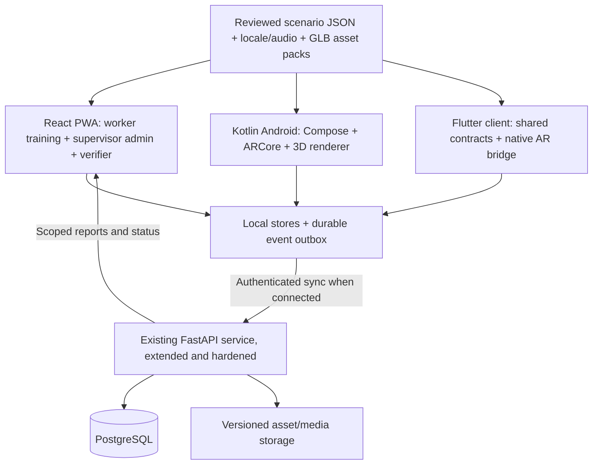

# Jaagruk: Complete SIH 2026 Enhancement Plan

Date: 28 September 2026. Problem statement: SIH26041. Status: implementation plan, not a claim that planned features already work.

## 1. Product Decision

Build a site-specific, offline vocational safety training system for mining, steel and mica workers. A worker should hear an instruction in their language, perform an action in a spatial simulation, see its consequences, receive a defensible assessment, and retain a verifiable training record. Supervisors should configure sites, assign training, identify practice needs and review evidence across devices.

The target includes a redesigned website, working backend, improved native Android app, realistic interactive 3D scenes, offline audio and simulations, and a Flutter client path. The owner is one developer. Milestones sequence this complete scope; completing the first two modules is an intermediate gate, not the end of the project.

Recommended stack: preserve React/Vite/Three.js for web, extend the existing Kotlin app for the primary Android AR implementation, and reuse the FastAPI backend already present in the Kotlin repository. Share versioned content, assets, API contracts and test vectors. Build Flutter against that stable contract after the native AR implementation is proven. Do not maintain independent rule sets for each client.

Selection cannot be guaranteed. The strongest evidence is a reliable, understandable demonstration supported by field feedback, reproducible builds and measured results.

## 2. Assumptions and Unresolved Inputs

| Input | Current position | Impact |
| --- | --- | --- |
| Team | One developer, confirmed by user | Sequential implementation; tightly shared infrastructure |
| Deadline | Not supplied | Estimates below are effort ranges, not calendar commitments |
| Required languages | Hindi and Santali per supplied PS; English for development/jury | Native-speaker review and offline audio are release dependencies |
| "Thai" in request | Could mean Santali; clarification pending | Keep Thai as a separate optional locale, never substitute it for Santali |
| Mobile preference | Kotlin exists; Flutter requested | Recommend native Android first; include Flutter as a later full client |
| Target hardware | Android 10+ mid-range; exact models unknown | Select physical ARCore and non-ARCore devices before performance commitments |
| PS text | Description cuts off at "(3) Machinery" | Domains four/five remain provisional pending complete official text |
| Safety review | No completed professional or language review established | Recruit reviewers early; software development can continue in parallel |
| Hosting/budget | Not supplied | Local development first; deployment costs measured before provider selection |

The official SIH page could not be retrieved during research. A public mirror reproduces the same truncated description. Do not silently invent missing requirements. The mirror lists 30 September 2026 as an idea deadline, but this was not independently confirmed against the official portal or the user's institution. Check the actual submission deadline immediately; a near-term submission and the full engineering roadmap are separate deliverables.

## 3. Evidence From the Existing Projects

Paths below are relative to the indicated repository unless linked explicitly.

### Website: `sih-safety-sim`

| Area | Observed implementation | Required improvement |
| --- | --- | --- |
| Training | Nine modules and 54 decision points visible in the current catalogue; five certification domains | Convert the quiz-led interaction into actions with observable scene consequences; preserve existing content |
| 3D | Procedural meshes and answer-driven animations in `src/components/SafetyScene3D.jsx` | Production asset library, rigged characters, equipment manipulation, lighting and sound |
| Camera AR | Compass/elevation overlays in `ARDrill.jsx` and `ARScene3D.jsx` | Explicit capability modes, acquisition lifecycle, reliable camera selection and readiness gating |
| Spatial WebXR | Hit tests, two-point alignment and live anchors in `XRScene.jsx`/`webxr.js` | Integrate consistently into drill flow; depth occlusion is explicitly unimplemented |
| Assessment | Accuracy, latency, hesitation and spaced refreshers | Separate training from assessment; validate timing and critical-failure rules |
| Certificates | Signed local hash chain and self-contained QR verification | Shared web/native codec, issuer trust, expiry/revocation states and trusted issuance policy |
| Offline | IndexedDB and PWA caching | Fresh-install/pack-ready guarantees, atomic content packs, recovery and storage-pressure tests |
| Vision/gestures | MediaPipe/EfficientDet fetched from CDN and cached after use | Ship required runtimes/models locally; do not describe first-use downloads as fully offline |
| Detection | COCO person/vehicle classes; no extinguisher, helmet, exit or forklift class | Explicit capability labels; separately evaluate any industrial detector |
| Santali | Ol Chiki UI, `SANTALI_VERIFIED = false`; speech substitutes Hindi | Reviewed translation, real Santali recordings or reviewed synthesized audio |
| Backend | Web client has configurable upload endpoint; no backend service in this repo | Integrate authenticated APIs from Kotlin project's backend |
| AI | Browser calls external providers using a locally stored user key | Optional backend gateway with consent, quotas and failure handling |
| UI | Marketing-heavy entry page, lengthy text, framed 3D viewport | Worker task home, full-screen simulation, separate supervisor workspace |

Current website evidence: [scene](../src/components/SafetyScene3D.jsx), [WebXR](../src/components/XRScene.jsx), [speech](../src/lib/speech.js), [Santali review state](../src/lib/i18nSantali.js), [vision](../src/lib/vision.js), [sync](../src/lib/sync.js).

An earlier orientation in this conversation ran `npm test` (357 passing tests) and `npm run verify` successfully. Those checks establish the existing automated baseline, not live-camera, native APK or production backend correctness. They were not rerun for this documentation-only plan.

Browser audit during this planning turn opened the home page, training catalogue and fire module. The desktop 3D scene rendered primitive equipment and a worker. Camera mode remained at "Starting camera..." while the decision timer advanced; the 3D fallback was accessible. This is an observed readiness problem in this browser session, not a diagnosis that every camera is broken. Physical camera frames, audible playback and phone AR tracking were not validated.

### Native project: `D:/Endeavors/Coding/Projects/Jaagruk - Kotlin`

| Area | Reusable implementation | Concrete gap |
| --- | --- | --- |
| AR | ARCore controller, camera rendering, pose projection and fallback modes | Drill presents pictogram markers; no production equipment/character asset library |
| Placement | Session anchors and optional cloud hosting | Placement uses a point two metres ahead; offline cross-session relocalization is incomplete; depth disabled |
| Core | Scoring, critical-step failures, retention, five modules/eleven scenarios | Catalogue and domain mapping differ from web; reconcile before syncing |
| Persistence | Room, transactional assessment/outbox writes, WorkManager | Prove cold offline runs, upgrade migrations and process-death recovery |
| Audio | Narration player and keyword command infrastructure | Drill calls `narration.speak(step.promptKey, "")`; reviewed audio assets absent |
| Gestures | Recognizer and handler exist | Frame feed/production invocation and model asset not integrated |
| Backend | FastAPI, SQLAlchemy, scoped authentication, sync, compliance and reporting | Migrations, durable revocation, refresh logout and deployment validation |
| Dashboard | React API-driven worker, hazard, reporting and compliance screens | Reuse workflows/API code; consolidate with redesigned web admin |
| Verification | Native offline verification; dashboard verification endpoint | Dashboard currently depends on online POST for verification |
| Relay | Nearby peer transfer and buddy state machine | Peer ACK can clear sender queue before central durable acceptance |

Read-only audit references:

- [Narration call](<D:/Endeavors/Coding/Projects/Jaagruk - Kotlin/android-app/src/main/java/org/jaagruk/safety/ui/drill/DrillViewModel.kt:335>).
- [AR configuration](<D:/Endeavors/Coding/Projects/Jaagruk - Kotlin/android-app/src/main/java/org/jaagruk/safety/ar/ArCoreController.kt:168>).
- [Anchor resolution](<D:/Endeavors/Coding/Projects/Jaagruk - Kotlin/android-app/src/main/java/org/jaagruk/safety/ar/AnchorResolver.kt:129>).
- [Backend sync](<D:/Endeavors/Coding/Projects/Jaagruk - Kotlin/backend/app/services/sync.py:99>).
- [Backend authorization scope](<D:/Endeavors/Coding/Projects/Jaagruk - Kotlin/backend/app/services/scope.py:62>).
- [Dashboard API queries](<D:/Endeavors/Coding/Projects/Jaagruk - Kotlin/dashboard/src/lib/queries.ts:65>).
- [Relay acknowledgement](<D:/Endeavors/Coding/Projects/Jaagruk - Kotlin/android-app/src/main/java/org/jaagruk/safety/sync/nearby/NearbyGossipService.kt:389>).

The backend mentions Alembic in startup instructions, but migration files/configuration were not found in the inventory. Treat migration support as unfinished until a clean PostgreSQL database can be created and upgraded through checked-in migrations.

`INFINITY_MOBILE` is a separate AI-oriented application, not the baseline safety client. Its large bundled model should not become a dependency of the training APK. Native/backend tests and APK execution were not run in this planning audit.

## 4. PS Coverage and Proof

| Requirement | Final deliverable | Acceptance evidence |
| --- | --- | --- |
| Android 10+, no headset | Signed APK, documented device tiers | Clean install and full training loop on named physical devices |
| At least two complete AR modules | Fire and gas first, with interaction and consequences | Live phone recordings, positive/negative branches, scored completion |
| Five safety domains | Fire, gas/confined space, machinery, plus provisional electrical and dust domains | Reviewed content matrix; correct official names when full PS obtained |
| Assessment | Versioned event-based scoring and critical failure rules | Golden fixtures agree across clients/server; latency excludes setup interruptions |
| QR issuance/verification | Offline signature verification and issuer trust; online status refresh | Second-device scan with internet off; tamper, unknown issuer and stale status tests |
| Hindi and Santali | Reviewed UI, scenarios, captions and offline narration | No missing release-pack strings/clips; reviewer sign-off and comprehension trial |
| Offline | Every shipped simulation and its assets/audio available locally | Fresh APK install in airplane mode; PWA after explicit pack installation |
| Web admin | Authenticated, site-scoped dashboard backed by real stored records | Android attempt appears once after sync; unauthorized access rejected |
| Public repository | Reproducible code, assets/licences, setup and release instructions | Fresh-machine setup and secret scan |
| Demo video | Short evidence-led walkthrough with live capture | Shows offline drill, consequences, QR verification and later sync |

A two-module certificate must state those modules. It must not imply that all five domains were passed. Training attestation and any legally recognized certification must be described separately; no automatic claim of DGMS approval.

## 5. Architecture and Reuse

Keep the two repositories intact initially. Publish a versioned shared content/contracts bundle consumed by both. Consolidating repository layout is optional after parity; copying entire applications into a new monorepo is not a prerequisite.

Proposed ownership boundaries:

| Component | Responsibility |
| --- | --- |
| Content package | Domain IDs, scenario state graphs, localization keys, audio manifests, asset IDs, review metadata |
| Simulation runtime | Validate actions, advance state, emit events; independent from UI/rendering |
| Renderer adapter | Three.js on web; native renderer with ARCore on Android; same asset semantics |
| Assessment | Consume events; apply versioned policy; preserve raw evidence and interruption flags |
| Content pack manager | Download/import, verify, stage, activate, roll back, report readiness |
| Sync adapter | Map local records to canonical wire format; retries and durable receipts |
| Backend | Identity, authorization, registry, persistence, reconciliation, reporting and publication |
| Presentation | React, Compose and later Flutter; share tokens and behavior, not component source |

The current web envelope (`format`, `records`, `Idempotency-Key`) is not automatically compatible with the native backend's batch/device contract. First document both, define a canonical version, implement adapters, and verify with fixtures. Never point the website at the backend and assume success from HTTP 200.

### Mobile technology decision

| Option | Strength | Cost / decision |
| --- | --- | --- |
| Existing Kotlin + ARCore | Largest reusable offline/native foundation; direct lifecycle and sensor access | Primary Android delivery path |
| React PWA + WebXR | Existing code and immediate browser access | Retain; spatial AR depends on browser/device support |
| Capacitor wrapper | Reuses web UI | Do not assume WebXR works inside Android WebView; prove or bridge native AR |
| Flutter + native AR bridge | Unified additional mobile UI with reusable native rendering module | Implement after native contract is stable; avoid recreating AR in Dart |
| Unity AR Foundation | Mature tooling for complex animation/physics | Contingency after an explicit performance/authoring spike; another engine raises solo maintenance cost |

Evaluate SceneView/Filament as the native rendering layer with one animated GLB spike on the actual target phone. Pin a tested compatible version. Do not upgrade to the newest release solely because it exists. Flutter platform views have composition/performance trade-offs documented by Flutter; test those with AR before committing to a plugin [S5, S6].

## 6. Complete UI Revamp

Design direction: a clear industrial training instrument. Off-white surfaces, charcoal text, teal for navigation/primary actions, amber for caution and red for critical errors. Reserve safety colors for meaning; pair them with icons/text. Keep high contrast over live video. Preserve familiar brand identity without making every screen an industrial poster.

Use existing locally bundled readable fonts where suitable; Noto Devanagari and Ol Chiki for script coverage. Normal reading text 16-18px, generous line height, zero negative tracking, tabular numerical data. Comfortable 48px or larger touch targets, up to 56px for drill actions. Validate under 200% text scaling. Icon controls need accessible names and tooltips where appropriate. Cards at most 8px radius; avoid nested cards and decorative containers around simulations.

| Screen | Final behavior |
| --- | --- |
| Worker home | Current worker/site, continue training, due refresher, offline-pack status, language/audio controls |
| Onboarding | Hear/select language, choose local worker or guest, optional supervisor enrollment, clear shared-phone sign-out |
| Training catalogue | Sector/domain filters, difficulty, duration, progress, installed status and accurate AR requirements |
| Drill preparation | Safe practice area, equipment context, camera/audio check, content readiness, chosen interaction mode |
| Live simulation | Full-screen camera/3D, one objective, compact progress, pause, audio replay, essential interactions only |
| Debrief | Action timeline, critical mistakes, evidence replay, understandable explanation and targeted retry |
| Worker progress | Module completion, next review, practice trend; avoid presenting unvalidated readiness as medical/work clearance |
| Certificates | Earned scope, issuer, date, QR, verification details, renewal/refresher status |
| Site setup | Floor-plan/zone view, origin alignment, equipment placement, rescan and supervisor validation |
| Buddy session | Pairing, assigned role, partner connection, checkpoint status, disconnect recovery |
| Hazard report | Photo/voice/text, zone, severity, local save, sync status and report history |
| Supervisor overview | Site/date filters, overdue training, recent attempts, critical mistakes, offline-device freshness |
| Worker directory | Search, filters, assignment, record detail, history and module evidence |
| Hazard triage | Owner, status, due date, evidence, resolution and audit history |
| Content management | Draft/review/publish module and locale packs with explicit versions |
| Offline centre | Size, installed versions, integrity, updates, failed downloads, import/export and storage management |
| Public verifier | Scan/paste/upload QR; signature, issuer, validity and status freshness shown separately |

The public project introduction can exist at a separate route. App launch should lead to useful work, not a long marketing page. Supervisor workflows should be dense and scan-friendly; worker workflows should minimize reading and choices.

Before broad component edits, create desktop/mobile designs for home, catalogue, live drill, debrief and supervisor overview. Use real scenario renders as thumbnails. Check all key screens at 360px and 412px mobile widths and 1280px/1440px desktop widths, plus portrait/landscape and keyboard navigation. Capture loading, empty, offline, denied permission, broken asset and expired-session states as part of the design.

## 7. Simulation Design

An assessment answer should correspond to something the worker does: identify an exit, activate an alarm, choose equipment, operate a control or complete a sequence. Multiple-choice questions remain useful for explanation and accessible fallback, but cannot be the only interaction behind an AR claim.

Use a deterministic state machine. Events include `OBJECT_SELECTED`, `ALARM_ACTIVATED`, `PPE_SELECTED`, `CONTROL_OPERATED`, `TARGET_AIMED`, `WAYPOINT_REACHED`, `BUDDY_CHECKED`, `TRACKING_LOST`, `NARRATION_ENDED` and `SESSION_PAUSED`. Each event carries scenario/content version, attempt ID, monotonic elapsed time, mode and relevant object/action IDs. Renderer animation follows state; animation completion is not itself proof of a correct procedure.

Each scenario defines prerequisites, allowed actions, critical errors, success states, recovery branches, narration/captions, asset references, assessment policy and review metadata. Save at checkpoints. A replay rebuilds the same state from events. Use shared fixtures to prove web/Kotlin/Flutter equivalence rather than attempting to share JavaScript execution everywhere.

Separate guided practice, independent assessment and refresher modes. Practice permits hints/replays; assessment records assistance, freezes the policy version and may require a supervisor. Start reaction timing only after instruction delivery, required assets and interaction readiness. Pause/exclude app interruptions, missing camera frames, lost tracking and audio setup. Preserve the existing ability for an informed user to act before narration finishes without charging narration time.

### Complete module inventory

These are software interaction plans. A qualified industrial trainer must approve the actual procedures, thresholds and equipment choices before field use.

| Module | Required interactions and consequences | Assets |
| --- | --- | --- |
| Fire / explosion | Find exit, raise alarm, decide whether intervention is appropriate, select equipment, operate approved extinguisher sequence, evacuate and assemble; wrong action changes scene and feedback | Extinguisher with moving pin/handle/nozzle, alarm, exit, fire/smoke effect, worker |
| Gas / confined space | Inspect simulated meter, validate entry conditions/permit, choose PPE, establish buddy/attendant, respond to alarm and withdrawal condition | Shaft/entry, gas meter with changing readings, PPE, attendant/buddy character |
| Machinery / LOTO | Identify energies, stop machine, isolate, apply lock/tag, account for stored energy, verify isolation and follow authorized restoration sequence | Conveyor/press, isolator, lock/tag, guard, control panel |
| Electrical | Recognize exposed hazard, maintain boundary, identify qualified response, isolate in the approved simulation and summon help | Electrical panel, cable, barricade, isolation control |
| Dust / respiratory | Identify simulated exposure, check engineering controls, choose appropriate protection, inspect fit/condition, change work practice | Mica processing equipment, extraction, masks/respirators, dust visualization |
| Warehouse/loading | Identify pedestrian route, respect vehicle exclusion, inspect load stability and sequence loading | Pallets, forklift, walkway and barriers |
| Roof/strata | Identify simulated warning conditions, stay outside unsafe zone, withdraw and report | Tunnel, supports, exclusion signage |
| Working at height | Inspect platform/edge protection and approved PPE, identify anchor location, plan access and response | Platform, rails, harness, approved anchor representation |
| Mine haulage | Select refuge/crossing, respond to vehicle signals, respect conveyor hazards | Haul road, conveyor, vehicle, refuge |
| Buddy drill | Assign roles, confirm checks, respond to missed check-in and raise alarm; prohibit unsafe simulated rescue choices | Two-device state, buddy animation, checkpoints |

Deliver fire and gas first, then complete the remaining modules. Reconcile native PPE/heights and electrical/first-response content with the web inventory so nothing useful is silently lost. Any additional domains from the complete PS enter the requirement matrix before content freeze.

## 8. AR That Matches the Claim

### Capability tiers

| Tier | What it supports | What it does not prove |
| --- | --- | --- |
| A: Native ARCore | Six-degree tracking, surface placement, session anchors, lighting estimate; depth occlusion when supported | Every Android 10+ phone is compatible |
| B: Supported WebXR | Browser hit tests/anchors and spatial scene placement | Native-level feature parity on all browsers |
| C: Camera overlay / marker mode | Live camera, guided pointing or reference-target overlay | Persistent room mapping or occlusion |
| D: Interactive 3D | Every procedural lesson, equipment interaction and assessment without camera | Spatial performance in the real room |

Android version is not an ARCore certification. Check the official supported-device list and runtime availability [S3]. Record assessment mode; do not certify spatial actions from a flat-mode attempt without an explicit policy allowing that substitution.

### Reliable offline site alignment

Store a local site coordinate frame, equipment poses, bounds, site/version ID and alignment evidence. At the start of each new session, relocalize using a known, feature-rich printed reference image with recorded physical dimensions, or a deliberate multi-point calibration flow. A QR can identify the site/pack but should not automatically be treated as a good ARCore image-tracking target. Google specifically cautions against QR codes and repetitive line art for Augmented Images [S4].

Use ARCore Augmented Images with a bundled image database for native offline relocalization; tracking is on device [S4]. For web, prove a suitable maintained image-tracking implementation in a spike or retain explicit manual alignment. Do not store raw session coordinates and pretend they remain valid after app restart. Cloud Anchors remain optional for connected deployments, never required for an offline drill.

Use surface hit tests and tracked poses rather than a fixed distance along the camera ray. Check plane suitability and placement stability. Reacquire after drift or tracking loss; hide or mark uncertain world instructions. Never promise reliable navigation in total darkness, smoke or a textureless environment.

### Camera lifecycle and USB testing

Implement one camera owner per active mode. The scan page, QR scanner, hand tracking and AR renderer must not independently compete for the same camera. Provide device selection for desktop USB webcams, reasonable constraint fallback, readiness only after actual frames, retry/cancel while permission is pending, track cleanup and recovery after device removal. Browser promises can remain pending while permission is unanswered; handle late stream arrival after cancellation and stop it.

A USB webcam can validate capture, resolution, overlays, device selection and marker detection. It cannot establish that phone ARCore tracking, inertial fusion or depth works. A connected Android phone tested through ADB is a different test path. Web phone testing requires a secure origin: use a documented HTTPS deployment or suitable localhost forwarding; ordinary HTTP on a LAN IP is insufficient for secure-context-only capabilities.

Release tests include denied/re-enabled permissions, camera busy elsewhere, unplug/replug, background/resume, rotation, low light, reflective steel, feature-poor walls, fast motion, unsupported depth, unavailable AR services and 15-minute thermal runs. Provide a clear recoverable state for unsupported conditions instead of pretending the sensor is working.

## 9. 3D Asset and Character Pipeline

Blender is the authoring tool; GLB/glTF is the intended portable asset format. Use licensed assets where appropriate and keep provenance. The current primitive models remain development fallbacks until production replacements pass validation. Blender/MCP automation is useful if available, but it is not a runtime dependency or a substitute for asset review.

Asset workflow: reference board and real dimensions -> model cleanup -> UVs/PBR materials -> rig and animation -> export -> mobile optimization -> render checks in both Three.js and the chosen Android renderer. Keep `.blend` source separate from shipped files. Validate only supported glTF material/animation extensions. Texture compression must have a tested decoder on each runtime, with a compatible fallback.

Character set: worker, buddy and supervisor variants with correct PPE. Animation clips: idle, look/point, walk, operate control, handle extinguisher, communicate, withdraw and assemble. Prioritize believable proportions, contact with the ground and readable actions. Detailed faces and expensive cloth simulation are lower value than an accurate hand/control interaction.

Environment set: steel workshop, mine entry/tunnel, mica processing bay, warehouse and elevated platform. AR uses the actual room as context and places only needed virtual equipment/hazards; standalone 3D uses the complete environment. Use metered effects, contact shadows and supported lighting estimation. Gas visualization must be explicitly a simulation aid: a normal RGB camera does not measure invisible gas concentration.

Initial engineering budgets, to be adjusted after device profiling:

| Metric | Starting target |
| --- | --- |
| Active character | Roughly 10k-25k triangles, lower-detail variant available |
| Visible scene | Roughly 100k-200k triangles; profile actual GPU cost |
| Draw calls | Prefer below 100 on the target mid-range device |
| Textures | Mostly 1K; 2K only where inspection needs it |
| Frame rate | Target sustained 30fps; report p95 frame time and thermal degradation |
| Cold installed-pack launch | Aim below 5 seconds after OS prerequisites are satisfied |
| Full offline distribution | All modules included in an offline edition; split optional high-resolution assets if size exceeds device/storage budget |

These are development budgets, not measured claims. Avoid real-time fluid physics for smoke/fire. Use optimized effects driven by a deterministic training model. Use a proven physics library only where contact, raycasts or object interaction require it, and keep assessment independent of nondeterministic physics.

## 10. Audio, Santali and Thai

Audio is part of the content package, not a best-effort browser service. Every required prompt, option, feedback line and critical instruction must resolve to a reviewed clip/caption pair. Use a manifest keyed by locale, content version and text key, with checksum, duration, transcript and reviewer status.

The playback service handles play/pause/replay, route changes, interruptions, volume/ducking, narration completion and non-overlapping queues. Stop recognition or suppress command acceptance during narration where echo could cause false answers. Provide captions and touch controls at all times. A missing clip must be visible in validation and cannot silently count as successful narration.

### Language production

1. Review canonical safety scripts with a trainer.
2. Draft Hindi/Santali translations; IndicTrans2 explicitly supports `sat_Olck`, so it is a candidate authoring aid [S7].
3. Obtain native-speaker correction of terminology, intent, pronunciation and regional suitability.
4. Record speakers or evaluate Indic Parler-TTS, which lists Santali and an Apache-2.0 model licence [S8]. Its page also requires access conditions and does not show a ready hosted inference provider. Plan a controlled authoring job, not a presumed free API.
5. Review every released clip with a speaker, especially negatives, warnings and equipment terms; synthetic support is not evidence of intelligibility.
6. Bundle approved audio with the application/content pack and run an automated missing-file/hash check.

The MMS family is an alternative research candidate, but its listed noncommercial licence matters, and a usable Santali checkpoint/API was not verified in this audit [S9]. Do not choose it from a claimed language count alone.

Do not ship a large generative speech model on every mid-range phone just to read fixed instructions. Generate audio before release. Runtime synthesis can remain optional for noncritical dynamic text.

Offline voice commands are a separate feature from narration. Reuse/evaluate the native keyword recognizer for a small explicit vocabulary; measure false accepts/rejects under noise and across speakers. General Santali dictation is not established by this plan. Browser speech recognition must never be required for offline completion. The gesture pipeline also needs real camera frames and device tests; touch remains available.

If Thai was intended, add `th-TH` as an independent, reviewed text/audio pack and verify a Thai-capable speech source separately. The primary SIH gate remains Hindi and Santali. Do not silently map Thai requests to Hindi or to Santali.

## 11. Offline Engineering

Two installation promises must be explicit: the full Android offline edition includes every required simulation/audio/model asset at install time; the PWA becomes offline-ready after an explicit verified installation of its packs. A completely uncached browser cannot load a website with no network.

Pack contents: manifest, schema/runtime compatibility, scenario data, GLBs, textures, scripts, audio/captions, fonts, optional inference runtimes/models, alignment image database and issuer trust material. Mandatory training must make no external CDN request. Version packages independently from the shell and pin an active attempt to its starting pack version.

Pack lifecycle: check space -> stage download/import -> verify signature and every hash -> activate atomically -> retain previous compatible version -> clean up safely. Resume interrupted downloads and preserve working content after an invalid update. Allow signed local file transfer for installation where network is scarce.

Persist attempt checkpoint, worker selection, event log, outbox and receipt state transactionally where possible. Do not delete the only evidence when cache cleanup occurs. Browser persistence is not guaranteed indefinitely: show storage state, support export/backup and detect eviction on the next launch.

Test cold airplane-mode launch, process kill mid-drill, OS restart, low storage, interrupted update, corrupt file, expired login, clock changes, shared-device worker switch, duplicate sync and partial server rejection. Every module must work offline in 3D; spatial AR additionally requires compatible hardware and installed platform services.

## 12. Backend, Sync and Certificates

Extend the existing FastAPI app. Use PostgreSQL for shared deployed data with checked-in migrations, media/asset storage and reproducible local setup. Reuse existing role/site scope and compliance code after integration tests. Keep service count small for solo operation; add a broker only if multi-process live events or job requirements justify it.

Core data: organizations, sites, zones, workers, supervisor memberships, enrolled devices, issuer keys, module/pack versions, assignments, attempts/events, certificates, revocations, hazard reports, media, sync batches/receipts and audit records. Map to existing tables before adding duplicates.

Contract work:

- Versioned schemas/OpenAPI; stable IDs and explicit web/native adapters.
- Authenticated enrollment and role/site authorization on every server operation.
- Durable refresh-session revocation; logout invalidates the relevant refresh session as well as access tokens.
- Per-record accepted/rejected/deferred receipts; queue items clear only after durable acknowledgement.
- Separate receipt at a peer from receipt at the server; retain recoverable data across relay loss.
- Retries with backoff and jitter, token refresh for 401, quota-aware retry for 429, quarantine invalid records with explanations.
- Immutable attempts/certificates; version-checked updates for mutable site/hazard data; visible conflict resolution.
- Media upload retries independent of core attempt sync, with size/type checks and checksums.
- Site-scoped dashboard queries, pagination, stale-data timestamp and safe reconnect for live updates.
- Health/readiness, structured errors, audit trail, backup/restore drill and deployment rollback.

Certificate design must converge on one canonical serialization/signature contract with vectors shared by JavaScript, Kotlin, Python and later Dart. Keep legacy records readable through an explicit version decoder; do not silently re-sign them.

A QR can prove payload integrity and signer possession of a key. It does not alone prove that the issuer is authorized or that the worker performed the actions. Define enrolled issuers, supervised assessment where required, content/policy versions and attempt evidence. Prefer device training attestations plus issuer-authorized certificates. If offline final issuance is required, use time/scope-limited delegated issuer credentials and clearly expose their trust state. Native hardware-backed keys are used where supported; report actual backing, never assume it.

Verification outputs: payload integrity, signature, recognized issuer, module scope, time validity, ledger relation where available, revocation status and last status refresh. Offline revocation knowledge can be stale; show the last trusted snapshot date. Test compact QR payload size/scannability rather than assuming a full event log fits. Keep personal data minimal and avoid embedding phone numbers or full logs.

AI hazard analysis/chat remains optional. Move managed provider credentials to the backend; authenticate requests, enforce budgets and explicit photo-upload consent, and provide curated offline answers. A model may suggest visible hazards for review; it must not announce that a workplace is safe or infer gas concentration from a camera. Free-form AI cannot change scoring or invent procedural instructions during assessment.

## 13. Testing and Release Gates

"Everything working" means defined supported configurations, reproducible successful journeys, handled failures and no unresolved release-blocking defects. It cannot mean that every camera, light level or Android device supports every AR capability.

| Layer | Tests | Pass evidence |
| --- | --- | --- |
| Content | Schema, all reachable/terminal branches, translations, reviewed assets/audio | No missing dependency in a published pack |
| Core | Scoring, interruption timing, critical errors, readiness, state replay | Matching cross-language golden vectors |
| Web | Browser journeys, responsive screenshots, canvas nonblank/movement, accessibility | All key flows usable; no overlap/console crash |
| Native | Unit/instrumentation, lifecycle, Room migration, WorkManager, signed APK install | Reproducible install and restart recovery |
| Backend | PostgreSQL integration, auth/tenant boundaries, replay, partial ACK, logout, media | No cross-site leakage or lost/duplicated accepted attempt |
| AR | Live device placement, walk/turn, reacquisition, occlusion where supported | Recorded device/build/light conditions and observed drift |
| Camera | USB selection, permission denial/recovery, device removal, first-frame readiness | Recoverable status and no permanently misleading live state |
| Offline | Cold start, all modules/audio, QR scan, device reboot, damaged update | No network required for installed training flows |
| Language | Native-speaker listening/reading and worker comprehension | Per-pack sign-off, no blanket accuracy claim |
| Security | Issuer trust, tampering, replay, expired session, revoked credential | Correct rejection or explicitly limited offline status |

Physical matrix: one lower-end Android 10+ device without spatial AR; one mid-range ARCore phone without assumed depth; one depth-capable phone; second phone for QR and buddy/relay; desktop webcam/USB camera. Use borrowed devices if necessary. Record actual model, OS, browser/AR services version, build and installed content version.

Provisional measurable release targets: at least 20 consecutive successful supported-device launches; two flagship drills each completed repeatedly online/offline; all other modules completed at least once per supported mode with branch fixtures; no lost acknowledged records across retry/process-death tests; no silent missing required audio; target 30fps measured over a 15-minute representative session. Set acceptable spatial drift from a calibration trial, then enforce the recorded tolerance. These are targets, not current results or statistical guarantees.

Use ARCore recording/playback for repeatable regression inputs, followed by live-camera checks. Recorded sessions do not replace hardware, lighting or thermal tests [S10]. End every feature slice with tests appropriate to its changed behavior; reserve the full matrix for integration/releases.

## 14. Solo Delivery Roadmap

Estimates are focused engineering days for one developer, assisted by tooling, assuming assets/hardware are obtainable. Translation review, field access and learning time can add calendar delay. Total primary web/native scope is approximately 65-112 focused days; Flutter adds approximately 12-22 days. Revise after the first complete slice. A short SIH deadline needs an honest staged demo, not a claim that months of work happened in days.

| Stage | Effort | Deliverable | Exit gate |
| --- | --- | --- | --- |
| 0. Freeze evidence/contracts | 2-3 days | Full PS check, feature inventory, device shortlist, baseline and shared schema | Requirement and ownership map agreed; backups retained |
| 1. Repair core promises | 4-7 days | Native narration wiring, web readiness gate, gesture integration, dependency inventory | One existing drill works with real audio and honest capability states |
| 2. Design system and application shell | 5-8 days | Worker/admin navigation, shared tokens, five key screen designs and components | Mobile/desktop layouts and accessibility states approved through inspection |
| 3. Simulation/asset foundation | 5-8 days | State machine contract, GLB loader, character/equipment spike and replay | Same sample action/state fixture on web and native |
| 4. Two complete flagship modules | 10-16 days | Fire and gas with spatial actions, consequences, audio and assessment | Physical-phone end-to-end offline evidence |
| 5. Remaining domains/modules | 10-18 days | Machinery, electrical, dust and existing extension modules | Reviewed content and working assets/interactions for every shipped module |
| 6. Backend and admin integration | 8-14 days | Canonical sync, real roles/data, certificates, audit, migrations and deploy setup | Offline Android/web attempts reconcile once into admin |
| 7. Language/offline packs | 6-10 days | Reviewed Hindi/Santali clips, full offline edition, pack update/import | Cold installed offline run of every module; reviewer sign-off |
| 8. AR refinement and multi-device | 7-12 days | Offline relocalization, supported depth, buddy/relay, performance | Named-device matrix passes and relay evidence survives failures |
| 9. Field validation and release | 8-16 days | Corrections, UX polish, reproducible release, video and submission evidence | No unresolved release blockers; limitations documented |
| 10. Flutter client | 12-22 days | Same worker flows, offline DB/packs, native AR bridge and shared backend | Contract, offline, device and simulation parity tests pass |

Start translation/trainer recruitment and asset sourcing during stage 0; waiting for those until stage 7 would stall release. Stage 6 contract discovery begins in stage 0 even if UI integration occurs later. Finish and verify one change stream at a time; a solo developer cannot execute all lanes simultaneously.

When the actual deadline is known, attach dates to these gates. For an imminent idea/internal-selection submission, prioritize the architecture, working existing baseline, honest gap list and a rehearsed demo. Keep the full plan as the subsequent implementation roadmap.

### First implementation batch

| ID | Work item | Initial locations | Acceptance |
| --- | --- | --- | --- |
| P0-01 | Resolve real text/audio at native narration call | Kotlin `DrillViewModel.kt`, `NarrationPlayer.kt` | Audible correct-language prompt; timing follows completion |
| P0-02 | Gate web assessment on selected-mode readiness | Web `Scenario.jsx`, `ARDrill.jsx`, speech lifecycle | Camera permission/tracking delay excluded; cancellation releases stream |
| P0-03 | Package required vision/gesture dependencies | Web `vision.js`, `gesture.js`, Vite/PWA; native recognizer | No first-use CDN/model download in offline edition |
| P0-04 | Define canonical content/event/QR contracts | Web lib, Kotlin core, backend schemas | Legacy decode and shared fixtures established |
| P0-05 | Repair ACK semantics | Web sync, native Nearby, backend sync | Per-record receipts; no evidence discarded after peer-only ACK |
| P0-06 | Validate native animated GLB + hit-test placement | Native AR controller + renderer adapter | Scale, animation, surface placement and 30fps target profiled |
| P0-07 | Create redesigned worker/drill screens | React shell, UI tokens and drill components | 360px/mobile and desktop coherent; full-screen simulation |
| P0-08 | Produce a reviewed sample audio pack | Existing Santali worksheets + new manifest | Speaker reviews a complete fire/gas prompt set before bulk generation |

## 15. Research and Competitive Position

Research date: 28 September 2026. Search results are incomplete; no defensible public ranking of the "best SIH26041 repository" was found. One relevant public implementation was identified. Its README and repository structure were inspected, not its deployed behavior or full test suite.

| Reference | Why it matters | Limit on inference |
| --- | --- | --- |
| SurakshaAR | Same PS; publishes camera/3D training, multilingual UI, assessment, certificates, offline storage and admin workflows | Published claims are not verified performance; do not copy the feature list as a quality ranking |
| Google ARCore SDK | Official sample implementations for phone AR behavior | Engineering reference, not a complete safety product |
| SceneView | Native rendering/AR candidate compatible with Kotlin direction | Requires a project/device spike and pinned tested dependency |
| AI4Bharat IndicTrans2 | Santali Ol Chiki translation candidate | Draft assistance; native review still required |
| AI4Bharat Indic Parler-TTS | Santali narration candidate | Model support does not establish safety-script pronunciation quality |

Jaagruk's proposed advantages should be demonstrated: site-specific offline relocalization, actions with consequences, reviewed Santali voice guidance, interruption-aware assessments, cross-device offline verification, and durable later sync. Current primitives plus a camera background do not prove those claims.

Remaining on PS26041 is a reasonable strategic choice given the existing investment and user objective. This research does not establish which unrelated PS is easiest to win or how competitors will be judged. Compare quality through real-device AR, offline completeness, language comprehension, procedural depth, trustworthy records and evidence, not repository stars or feature count.

## 16. Field Validation and Submission

Recruit a small formative group of adult trainees and a qualified trainer where access permits. A proposed first usability round is 5-8 people, followed by a larger pilot if feasible. Record task completion, help needed, critical mistakes, command false triggers, device failures and comprehension by language. Measure before/after procedural performance and a delayed follow-up without presenting a small uncontrolled pilot as proof of accident reduction.

Prepare a 4-6 minute demo: choose Hindi/Santali -> show airplane mode and installed content -> align a practice space -> perform fire response with visible consequences -> show gas/buddy sequence -> debrief -> issue an accurately scoped record -> verify it on a second offline device -> reconnect and show the same record in the admin dashboard. State which segments are live and which are recorded; never use replay as undisclosed live AR.

Submission bundle: signed APK and checksum; source and setup instructions; public repository when authorized; content/asset licences; architecture and PS coverage matrix; test/device report; reviewer evidence; demo video; sample signed packs and non-personal sample records; known limitations and reproducible deployment procedure. Retain release signing keys outside the repository.

Final release gate: all required module flows and offline narration complete; supported-device camera/AR evidence collected; full negative paths handled; web/native/backend contract parity proven; language and safety reviews attached; no blocker hidden behind an "AI", "AR ready" or "offline" label.

## 17. Sources

- S1: [Public PS26041 mirror](https://github.com/vedantchalke36/sih-2026-problem-statements/blob/main/ps_2026/SIH26041.md). Secondary source; official text/deadline still need confirmation.
- S2: [SurakshaAR repository](https://github.com/tusharambastha/SurakshaAR). Published competitor claims and structure only.
- S3: [Google ARCore supported devices](https://developers.google.com/ar/devices). Device certification and capability checks.
- S4: [ARCore Augmented Images](https://developers.google.com/ar/develop/augmented-images). Offline reference-image tracking and target-quality constraints.
- S5: [SceneView repository](https://github.com/sceneview/sceneview). Candidate native renderer/AR integration.
- S6: [Flutter Android platform views](https://docs.flutter.dev/platform-integration/android/platform-views). Native view embedding and performance trade-offs.
- S7: [AI4Bharat IndicTrans2](https://github.com/AI4Bharat/IndicTrans2). Santali `sat_Olck` language support.
- S8: [AI4Bharat Indic Parler-TTS](https://huggingface.co/ai4bharat/indic-parler-tts). Listed Santali support, licence and access/inference availability.
- S9: [Meta MMS TTS](https://huggingface.co/facebook/mms-tts). Multilingual model family and licence; specific Santali deployment not established.
- S10: [ARCore recording/playback](https://developers.google.com/ar/develop/recording-and-playback). Recorded sensor/camera sessions for testing.
- S11: [ARCore Android SDK](https://github.com/google-ar/arcore-android-sdk). Official implementation samples.
- S12: [ARCore Depth developer guide](https://developers.google.com/ar/develop/java/depth/developer-guide). Runtime depth support and integration.

No production code was changed to create this plan. Do not treat any future-tense deliverable, budget or acceptance target here as completed work.
